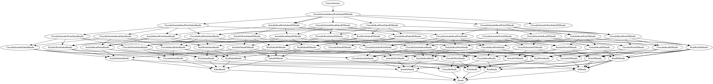

# HSL IO Key Design Decisions

# Status:

Fully implemented in Hack code (https://github.com/hhvm/hsl-experimental and Facebook WWW); widely used externally by most CLI applications in Hack, including HHAST’s LSP support. Originally derived from HHAST LSP server’s async IO implementation.

Used in Facebook www in limited places due to ‘experimental’ status.

# Summary:

HSL IO aims:

* to be a 100% replacement for PHP IO builtins functions and and related resources (files, sockets, stdio, etc); it is meant to unblock their removal (among other things), so a 90% solution is not acceptable.
* to replace or reduce the need for additional HHVM extensions when async clients for network services are needed
* be a true ‘async-first’ design
* use the type system for as much safety as possible. For example, files opened read-only do not have ‘write’ methods; this is comparable to Java exposing separate InputBuffer and OutputBuffers.

It is composed of several new namespaces:

* `HH\Lib\OS`: this is a thin layer exposing the traditional C File-Descriptor-based APIs; minimal changes are made to the C APIs.
    * Direct usage is *strongly* discouraged: no attempt is made to make APIs hard-to-misuse. For example, if `OS\write("foo")` only writes 1 character, this is considered success, not a failure, and users must check for it - just like in C.
* `HH\Lib\{File, Unix, TCP}`: functions, classes, and interfaces that are specific to a particular kind of IO ‘handle’.
* `HH\Lib\{IO, Network}`: functions, classes, and interfaces that are shared or reusable between multiple kinds of IO handles

## Why a design document:

* While this is not a language change, it will be part of a fundamental change to how Hack programs work: it should eventually replace `php://input`, `php://output`, `print()`, etc. See ‘Future Work’ for details.
* there are some contentious design issues; **the primary contentious issue is that the user-facing APIs are not ‘disposable-first’.**

This document is **not** intended to be a full API design review of the library; however, for completeness, the full APIs can be reviewed in the documentation at https://docs.hhvm.com/hsl-experimental/reference/

# Feature motivation:

The primary motivations are:

* async support: this is already needed by projects such as HHAST, and is desired externally to allow replacing the PHP redis extension with an async library.
* portable, reliable error detection and handling. The PHP builtins return false and log a warning, while `posix_get_last_error()` , `posix_errno()`, and `socket_last_error()` are unreliable, especially when async or CLI server mode is being used; they also depend on mutable global state.
* it is a necessary step in the removal of PHP `resource` types; file/stream/socket resources have observable destructor-like behavior

Additional motivations are:

* type system: with current PHP APIs, files, mysql connections, streams, curl handles all share the same `resource` type
* type system: `T | false` return types are prevalent and not supported by the Hack type system.
* consistency: sockets are sometimes stream resources, sometimes socket resources, depending on how they are created. Each has different limitations

## Prioritization factors:

Making HSL IO built-in will unblock work on:

* removing PHP IO primitives
* redesigning the entrypoint API - for example, removing `STDIN`, `STDOUT`, `php://input`, `php://output`
    * this in turn currently blocks removal of PHP globals
    * this is a soft-blocker on adding a friendly, type-safe alternative to the current xbox parallelism APIs

# User experience:

```Hack
$file = File\open_write_only(
  '/tmp/foo.txt',
  File\WriteMode::OPEN_OR_CREATE, // optional
  0644 // optional
);
// Close the file handle on scope exit:
using $file->closeWhenDisposed();
$conn = await TCP\connect_async(
  'localhost',
  8080,
  shape( // optional
    'timeout_ns' => 123,
    'ip_version' => Network\IPProtocolBehavior::PREFER_IPV6,
  ),
);
using $conn->closeWhenDisposed();
// Write "foo\n" or throw:
await $file->writeAllAsync("foo\n");
// Ditto:
await $conn->writeAllAsync("foo\n");
// the OS\write()/POSIX behavior:
await $conn->writeAllowPartialSuccessAsync("foo\n");
$conn->close();

// Line- and character-based operations
$br = new IO\BufferedReader($file);
$line = await $br->readLinexAsync();
foreach ($br->linesIterator() await as $line) {
  // do stuff with each line, without awaiting in a loop
}
$chunk = await $br->readUntilAsync("\nMARK\n");

// Escape hatch in case you have an edge case we don't have a
// high-level API for:
$fd = $file->getFileDescriptor();
invariant(!OS\isatty($fd), '/tmp/foo.txt is a tty?!');

$stdin = OS\request_input();
if ($stdin is IO\FDHandle) {
  // probably CLI mode
  if (OS\isatty($stdin->getFileDescriptor())) {
    // do interactive things
  } else {
    // Maybe `myapp < /tmp/foo.txt` or `someotherapp | myapp` ?
    // do non-interactive things
  }
} else {
  // probably POST data, and $stdin->getFileDescriptor() would be a type
  // error. Equivalent to `php://input` thing, which may or may not be
  // backed by a real FD; it isn't when using proxygen.
}
```


`$file` is a `File\CloseableWriteHandle`; in turn, this is an `IO\CloseableSeekableWriteHandle` and:

* an `IO\Handle`: this is an empty base interface
* an `IO\CloseableHandle`: an `IO\Handle` with `close()`; currently, all concrete `IO\Handle`s are closeable, but others have been suggested in the past; e.g. a `IO\server_error()` handle returning process STDERR; an individual request should not be able to close HHVM server stderr.
* a  `IO\WritableHandle` and an `IO\SeekableHandle`
* an `IO\FDHandle`: this is the integration point with the `OS\` namespace: this means that:
    * `$file->getFileDescriptor()` is available and returns an `OS\FileDescriptor`
    * The majority of operations (e.g. writing) are implemented using `OS\` functions, e.g. `writeAllAsync()` is implemented with `OS\write()`  and `OS\poll_async()`

`$conn` is also a  `Closeable`, `Writable`, and `FileDescriptor` Handle, but it is not a `Seekable` handle.

These interfaces are best thought of as intersections: a FooBarBazHandle is a FooBarHandle, FooBazHandle, BarBazHandle, FooHandle, BarHandle, and BazHandle. Concretely, a CloseableReadWriteHandle is a CloseableHandle, a ReadHandle, a WriteHandle, a ReadWriteHandle, a CloseableReadHandle, and CloseableWriteHandle. Function authors should aim to describe what functionality they need when restricting input types, and take less specific interface possible - for example, if a function only needs to call `writeAllAsync()`, it should take an `IO\WriteHandle`, not a `File\WriteHandle`

`IO\Handle`s are not disposables; they must manually be closed, or `closeWhenDisposed()` should be called to get a disposable that will close on exit. This disposable is not itself an `IO\Handle`.

# Implementation details:

The majority of `IO\Handle`s are `IO\FDHandles`, built on top of an `OS\FileDescriptor`. This is a native object which is a thin wrapper around the C int file descriptor concept, which ensures that:

* file descriptors are not left open at the end of the request. Refcounting is not observable - if not explicitly closed, file descriptors are closed at the end of the request.
* they are transferred between the client and server correctly in CLI server mode
* if a closed FD number is re-used, operations on the original handle will fail, instead of working on the new FD with the same number. This is essential for correctness in a multi-request single-process environment.

For example, a `writeAllowPartialSuccessAsync()` call ends up being a call to `OS\write($this->fd)`.

`OS\write()` is a very thin Hack wrapper around the native builtin `HH\Lib\_Private\_OS\write()`; the separation of responsibilities is that:

* native functions are responsible for cross-request correctness/isolation
* everything else is the responsibility of the Hack code

For example, `_OS\write()` may throw an `_OS\ErrnoException()`, and `OS\write()`  may catch this and instead throw an `OS\FileNotFoundException`; as user-facing exception hierarchy is a very subjective and opinionated area, it is left for the Hack code.

Async support for IO`\FDHandle` is built on `O_NONBLOCK`, and libevent/libevent2’s FD support.

The current exception hierarchy is based on Python 3’s work, which appears well received. Concretely, there is:

* `OS\ErrnoException`: this is both a base class, and instantiable when there is not a more specific exception
* many subclasses for failures that frequently caught, e.g. `OS\AlreadyExistsException`, `OS\IsADirectoryException`, `OS\IsNotADirectoryException`

While `catch (OS\ErrnoException $e) { switch ($e->getErrno()) { /* ... */ }}` is possible, the hierarchy aims to make this an antipattern in the common case.

### Required Changes

Implementing this HIP would require moving the relevant code from Facebook’s www repository and the github hsl-experimental repository to HHVM builtins, and adding appropriate HHIs.

# Design rationale and alternatives:

## API is not Disposable-based

There were previously strong opinions that all IO handles should be Disposable, and closed when disposed.

### Context: current usage of *“PHP IO”* features is not representative of IO as a whole

The vast majority of PHP IO usage in Facebook WWW should be using Disposable-based APIs, specifically APIs focussed on temporary files. However, the majority of IO does not go through PHP IO, or things we usually think of as “the IO library” - it uses dedicated extensions, such as:

* Thrift
* McRouter
* MySQL
* Various FB-proprietary extensions

We aim for HSL IO to be usable for implementing clients instead of extensions for other services that are not currently supported (for example, gRPC, Redis) but solve similar use cases; as such, we should be asking ourselves: “would this design choice prevent us from reimplementing McRouter in Hack using HSL IO?”.

I do not believe that disposable-only Thrift/McRouter/MySQL/<censored> APIs would be practical for Facebook for the same reasons that I believe that HSL IO can not be disposable-only, detailed below.

### Non-composability makes Disposables unsuitable for “100%” solutions

Alternatively: Disposable is a ban on encapsulation.

* this makes them impossible to use as a hidden implementation detail of a higher-level API
* as such, they can never be an essential part of an API that we expect others to build on

If HSL IO was Disposable-based, and a 100% replacement:

*  a pure Hack async Redis client could not contain a `TCP\Socket` as an implementation detail. Instead, either:
    * it would need to be passed around to every function, and could not be hidden in a ‘Connection’ object or similar
    * every operation on Redis would need to open a new TCP connection. This is unacceptable from a performance perspective.
* TLS/SSL can not be implemented as a wrapper around TCP or Unix IO handles, or other transports. Users would need to explicitly wait for events on the socket handle, pass them (and the socket) on to the TLS handler, and see if any post-TLS state change was observable.
* `interface Logger { public function logAsync(string $message): Awaitable<void> }` could be implemented in three ways, none of which are practical:
    * Open and close the file descriptor inside that method every time `logAsync()` is called; this is unacceptable performance-wise even for local files, and definitely for networked logging services.
    * Take any necessary IO handles as `<<__AcceptDisposable>> IO\WriteHandle` parameters. This is bad for usability, prevents implementation hiding, and requires a codemod to add an extra arg to every callsite if we ever want to log to two places (e.g. when migrating logging frameworks).
    * Discard the log message, without displaying or saving

### ‘Virality’

I mean this in a similar sense to ‘viral licenses’: if one thing is Disposable, everything that touches it must also be Disposable, recursively.

Using the previous `Logger` example: if we make the IO handle a parameter, any component that could possibly want to log - or use another component that may want to log - would need to take an `<<__AcceptDisposable>> $logTo` parameter.

If the common ‘controller’ pattern is used:

* due to the composition restrictions, this must be an explicit parameter to every single method
* if those composition restrictions were weakened to allow disposables to contain other disposables, there seem to be two approaches:
    * add a disposable ‘callcontext’ parameter to every method instead of needing the IO handle to be its’ own parameter
    * make every controller disposable, and likely the majority of the call stack in both directions; store the ‘callcontext’ as a property
* both are substantial changes to code structure, and will lead to a large amount of boilerplate


For some use cases (e.g. live stream uploads), it *must* be possible to access raw IO streams for POST data; this means that the web controller stack would have similar needs to the hypothetical logger case.

### An alternative: special cases

Instead of making it so that STDERR or similar is passed through the application, we could keep it accessible via a free function. The next immediate problem is that the first function that logs to STDERR will acquire it as a disposable, and automatically close it when that function exits.

We could address this by special-casing the STDIO handles to not actually close on exit, or by making them global constants similar to the existing STDIN/STDOUT/STDERR constants (which would require allowing constants that are objects, and that implement IDisposable).

The major shortcoming here is that replacing “log to STDERR” with “log to file”, “log to syslog”, or “log to my favorite SAAS logging provider” becomes a massive challenge requiring refactoring of every logging callsite. It also is itself a breach of encapsulation, as a `IO\WriteHandle` parameter without `<<__AcceptDisposable>>` will effectively be the same thing as an `STDIOWriteHandle`.

This could be avoided by implementing a special API to ‘strip’ d

### An alternative: ‘leases’

Instead of the disposable actually controlling open/close, it could be an indirect reference to the *real* IO handle (similar to a shared_ptr). This would address:

* the ‘every method call needs a reconnect/reopen’ problem
* the ‘pass stderr/a log device to every function’ problem
* the ‘if I don’t get passed stderr, but get it from a global accessor, a disposable for stderr in my function, and it’s disposed, have I just closed it for every other function?’ problem

This is not actually a solution for Disposable-based IO handles: it is equivalent to “not Disposable-based” as it requires there to be an underlying non-disposable IO handle backing this, and requires it to be possible to acquire one from a disposable, removing the desired safety.

## No locking/queuing

This is undefined behavior:

```Hack
concurrent {
  await $f->writeAllAsync('FooBar');
  await $f->writeAllAsync('HerpDerp');
}
```

As `OS\write()` can partially succeed, even with a single thread, this can result in `FooHerpBarDerp` or many other sequences.

In an early experimental version of HSL IO, write operations were queued, meaning that “FooBarHerpDerp” and “HerpDerpFooBar” would be the only possible results from the above code. This queueing was removed when callers were added that were essentially:

```Hack
concurrent {
  await async {
    await $f->seekAsync(123);
    $data = await $f->writeAllAsync("foo");
  };
  await $f->writeAllAsync("barbaz\n");
}
```

This was similarly undefined behavior; additionally, there is no guarantee that the “foo” write is the next write after the seek.

This queuing was removed as the only way to make multiple writers actually safe is to add application-level locking/queuing that spans multiple IO operations (such as `Async\Semaphore`, or linked-list-of-awaitable-style queues). Removing this built-in queuing also removed the need for methods like `seek()` and `close()` to be async.

## Exception Hierarchy

HSL IO/OS’s exception hierarchy is heavily influenced by Python 3; this is a substantial change from Python 2, described in https://www.python.org/dev/peps/pep-3151/. These tend to indicate the cause of failure, rather than what went wrong. For example, opening a file may fail with a FileNotFoundError, not a FileOpenError.

The primary goal for HSL IO was for the exception type to be sufficient to determine the appropriate action; in particular, we did not want this to become a common pattern:

```
try {
  ...
} catch (IO\Exception $e) {
  switch ($e->getErrno()) {
    case ENOENT:
      ...
    ...
  }
}
```

Instead, we wanted most code to look like this:

```
try {
   ...
} catch (OS\FileNotFoundException $e) {
  ...
}
```

This difference is very similar to the change that has been made between Python 2 and 3, and the Python 3 hierarchy meets HSL IO’s design goals, and is well received by the Python community. While the first form is still possible (and necessary for some rare cases), it is not the usual pattern. Java and Ruby take a similar approach.

There is a more in depth discussion and cross-language comparison at https://github.com/hhvm/hsl-experimental/issues/37

## “ReadWrite” handles vs separate read and write handles

An early version of HSL IO did not have read-write handles; instead, you could have both a read and write handle for the same file. This would have reduced the number of interfaces significantly, and resolved some of the issues that the locking/queuing were also meant to address, assuming the two handles operated independently.

This feature was removed and replaced with ReadWrite handles as there is not adequate portable support in libc:

* opening the resource twice, in different modes, is not possible for some kinds of FDs
* if split with the C `dup()` call, they are not truly independent, and behavior various by platform. For example, a `seek()` on the ‘read’ FD may also seek the ‘write’ FD.

# Prior art:

## Disposable API

Rust, Python, and the Qt C++ library all provide disposable-like behavior, however it is either optional, or additional language features (pointers, borrowing) or weaker restrictions (e.g. composability) address the problems.

`File`s and `Socket`s in Rust have Disposable-like behavior/restrictions, however the “borrowing” language feature provides a clean way to avoid the issues raised previously.

In Python, `with` is strongly encouraged, but is optional. This provides safety for simple cases, but allows the flexibility needed to address others (e.g. composition is permitted).

QIODevice, QFile, and QTCPSocket classes in the Qt library for C++ are non-copyable like disposables, close on destruct, however pointers and composition are permitted, avoiding the problems above.

## Implementation based on File Descriptors

Rust and Python take a similar approach to HSL IO: common operations are provided via high-level classes - however the raw file descriptor is available for niche operations. HSL IO differs in that an object wrapper is used (`OS\FileDescriptor`) instead of directly exposing the int.

The wrapper object is needed for correctness in CLI-server mode, and in a multi-request environment.

## BufferedReader as a separate class

Buffered reading was split out to a separate class as mixing buffered and unbuffered reads leads to undefined and unintuitive behavior; for example, `readByteAsync()` may have read and cached 1024 bytes but only returned the first 1. Unbuffered reads need to remain possible for packet-based network protocols.

Rust (`std::io::BufReader`), Java (`java.io.BufferedReader`), and Python (`io.BufferedReader`) all take the same solution to this problem.

Python also offers implicit buffering when opening a file, however this makes all operations buffered - it does not mix them.

## Read and Write in the type system

In Rust, `Read` and `Write` are distinct interfaces - however, `File::open()` always returns a `File`, which implements both, regardless of the open mode. This allows functions to specify that a parameter only needs to be readable, but it remains possible to pass a write-only file to such a function.

Java IO is similar to HSL IO for handling of read (via `InputStream`), write (via `OutputStream`), and read write (`ByteChannel`) for files - however these are created via separate functions/methods, and are not part of a `File` or `Socket` object. For example, a `Socket` does not extend `OutputStream`, but provides `getInputStream` and `getOutputStream` methods. This design encourages APIs to take `InputStream` or `OutputStream` parameters instead of `Socket`s, providing similar benefits to HSL IO’s `IO\ReadHandle` and `IO\WriteHandle` separation.

# Unresolved questions:

- `var_dump()`, `print_r()`, etc: setting `O_NONBLOCK` on stderr breaks a lot of debugging utiltities, especially with large outputs. Should they set `O_NONBLOCK off temporarily, or should they be async, or hidden `HH\Asio\join`?

- What do we ‘encourage’ in www, e.g. via namespace aliasing?
  * `IO\`: yes, especially the interfaces
  * `OS\`: yes: while the functions in this namespace should very rarely be used directly, the exception classes should, and this is the correct place for them
  * `File\`: maybe; we may want to only encourage wrappers instead, e.g. restricting what paths can be opened.
  * `TCP\`, `Unix\`, `Network\`: yes: these will be rarely used, but are so niche that it is unlikely that general-purpose wrappers will be written.

# Future possibilities:

## Entrypoint API

In order to remove the PHP STDIN, STDOUT, STDERR constants, $_POST, $_GET and similar, we need to define a replacement. This should be built on HSL IO, and will effectively tie all Hack programs to some aspects of HSL IO’s design - in particular, if HSL IO handles were disposable, this would apply severe constraints to the design of Hack programs.

Suggestions have included:

```
<<__CLIEntryPoint>>
async function main(
  vec<string> $argv,
  vec<string> $envp,
  IO\ReadHandle $stdin,
  IO\WriteHandle $stdout,
  IO\WriteHandle $stderr,
): Awaitable<void> {}

<<__CLIEntryPoint>>
function main(CLIRequestContext $ctx): void {
  $argv = $argv->getArgv();
  $stdin = $ctx->getStdin();
}

<<__WebEntryPoint>>
function main(WebRequestContext $ctx): void {}

<<__EntryPoint>>
function main(): Awaitable<void> {
  $argv = OS\argv();
  $envp = OS\envp();
  $stdin = OS\stdin(); // an IO\CloseableReadFDHandle or throw
  $input = OS\request_input(); // CLI STDIN or HTTP POST data (php://input)
}
```

While the specific API does not matter at this point, this both constrains - and is constrained by - HSL IO’s design, especially if Disposables were used. If Disposables were used, the ‘virality’ issues above will be severe for every Hack program that does any form of IO, including sending HTML to the browser.

## Remove PHPisms

IO `resource`s inherited from PHP are:

* one of the remaining cases of observable refcounting/destructor-like behavior
* poorly typed: it should be a type error to pass a file resource to curl_exec when a curl handle is expected

Once HSL IO is built-in, we can start to remove these.

* removing the PHP builtin STDIN, STDOUT, STDERR constants will be possible when a new entrypoint API is agreed on; that will potentially allow complete removal of the ‘PlainFile’ resource type too
* removing further resource types will be possible as HSL IO is extended, in particular with TLS and subprocess support.

## Denotable intersection types

There are various operations that are only appropriate for some handles, e.g.:

* read()
* write()
* seek()
* getpeername()

Each set of related operations is represented by an interface, e.g.:

* `IO\ReadHandle`
* `IO\WriteHandle`
* `IO\SeekableHandle`
* `Network\Socket`

As mentioned in ‘user experience’, each combination needs its’ own interface in order to be usable as a parameter type; for example, if a function needs to read, write, and seek, it takes an `IO\SeekableReadWriteHandle`.

Early versions of HSL IO contained manual definitions of the ‘reasonable’ combinations, but this was a frequent source of bugs due to oversights. Now the interfaces are generated, which means that if any new interface is added, the number of generated interfaces roughly doubles. Currently, there are 26.

There have been requests/suggestions for additional interfaces, e.g.:

* TruncatableHandle
* RewindableHandle as distinct to Seekable
* DisposableHandle

If these (or any other 3) were added, there would be 245 generated interfaces; if 5 were added, we’d get to 1010. This is not scalable.

We will either need to be extremely selective about what new interfaces are added, or we will need a new way to represent these types. Denotable intersection types are the clearest fit, as these empty interfaces are effectively defining intersections:


```
- interface ReadWriteHandle extends ReadHandle, WriteHandle {}
+ type ReadWriteHandle = ReadHandle & WriteHandle;
```

The main advantage is that the intersections do not need to be predefined: currently, if a function needs to `read()` and `seek()`, it should take an `IO\SeekableReadHandle`, which must have been predefined in the HSL, and implemented by the concrete handle being passed.

If denotable intersection types were supported:

* if `IO\SeekableReadHandle` was defined as an intersection, it would not need to be explicitly present in the type hierarchy of the concrete implementations
* `IO\SeekableReadHandle` does not need to be predefined: a function could take a `IO\SeekableHandle & IO\ReadHandle` parameter instead.

This would:

* greatly simplify the type hierarchy (below)
* allow decisions about interfaces to be made purely on the usability/correctness merits

### The type hierarchy of a read-write file handle without denotable intersection types



### The type hierarchy of a read-write file handle using denotable intersection types


## Disposable IO API

While a non-disposable IO API is essential as a building block for higher-level libraries (e.g. redis clients), a Disposable API is highly desirable for operations we commonly think of as IO, like opening files and directly interacting with a TCP socket. This can be built on top of a non-Disposable API, but a non-Disposable API can not be built on top of a Disposable API.

Some ways this could be implemented:

### Wrappers

A `File\DisposableReadWriteHandle` could wrap a `File\ReadWriteHandle`; functions should aim to specify their parameters as `<<__AcceptDisposable>>` wherever possible.

This requires another interface (and the corresponding doubling of generated interfaces), and hand-written wrappers for each instantiable handle class.

### Add an “optionally disposable” language feature

The user experience would be similar to Python’s `with`:

```Hack
class File implements ..., IOptionallyDisposable {
  // ...

  public function __dispose() {
    $this->close();
  }
}

// No `using`, __dispose is simply not called:
$f = new File('/tmp/foo');
// ... so must manually close:

$f->close();

using $f = new File('/tmp/bar');
// automatically closed  - but you can call `$f->close()` earlier if you want

```

This should be a separate HIP, but I believe it would be the best approach:

* no need for 2x the classes/interfaces: good for maintainability and discoverability
* good for discoverability: only one API

There is one major issue with this concept though:

```Hack
function takes_rh(IO\ReadHandle $_): void {}
function takes_drh(<<__AcceptDisposable>> IO\ReadHandle): void {}

takes_rh(new File('/tmp/foo')); // No error

using $f = new File('/tmp/foo');
takes_drh($f); // No error
takes_rh($f); // error?
```

Error: it is being used as a disposable, so should act like one
No error:  IOptionallyDisposable would primarily be useful for convenience; it should not be considered an ‘ownership’ model. As such, it is likely that `__dispose()` calls another public method (like `close()`), so if something keeps hold of the handle after __dispose was called, it may be in a bad state, but this state would be reachable even if it wasn’t disposable.
