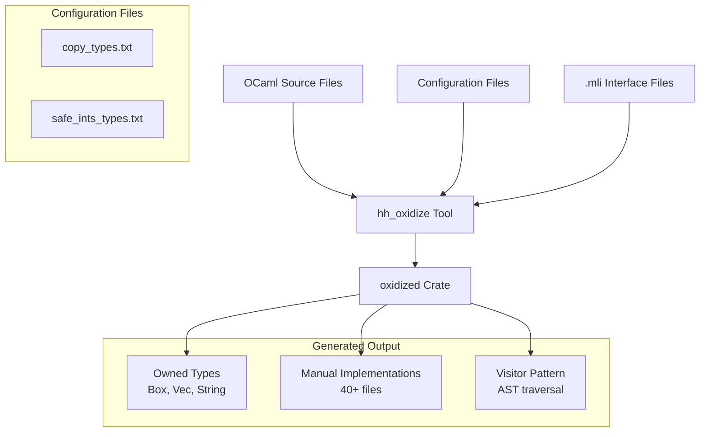

# HH Oxidize - OCaml to Rust Type Generator

This document provides comprehensive information about the `hh_oxidize` tool,
which converts OCaml AST definitions to Rust types, generating the `oxidized`
crate.

## Overview

`hh_oxidize` is a command-line tool that parses OCaml source files and generates
corresponding Rust type definitions with owned, heap-allocated types.

## Architecture



## Core Components

### 1. Main Entry Point (`hh_oxidize.ml`)

**Purpose**: Command-line interface, argument parsing, and orchestration of the
conversion process.

**Key Functions**:

- Parse command-line arguments and configuration files
- Process OCaml source files using OCaml's compiler-libs
- Format output with `rustfmt` and sign files
- Generate module manifests (`mod.rs`)

**Usage Examples**:

```bash
# Generate oxidized crate
hh_oxidize \
  --copy-types-file copy_types.txt \
  --safe-ints-types-file safe_ints_types.txt \
  --out-dir gen/ \
  source_file.ml
```

### 2. Configuration System (`configuration.ml`)

**Purpose**: Central configuration management for type conversion decisions.

**Configuration Types**:

```ocaml
type t = {
  extern_types: string SMap.t;   (* Type re-exports *)
  copy_types: SSet.t option;     (* Types implementing Copy *)
  safe_ints_types: SSet.t;       (* OCamlInt preservation *)
}
```

**Key Decision Functions**:

- `extern_type`: Look up external type mappings
- `copy_type`: Determine if type should implement Copy
- `safe_ints`: Check if int should be OCamlInt vs isize

### 3. Type Declaration Converter (`convert_type_decl.ml`)

**Purpose**: Core logic for converting OCaml type declarations to Rust
equivalents.

**Major Responsibilities**:

#### Type Conversion Patterns

- **Variant Types**: Convert to Rust enums with proper discriminants
- **Record Types**: Convert to Rust structs with field transformations
- **Type Aliases**: Handle newtype patterns vs simple aliases
- **Recursive Types**: Box wrapping for recursive type definitions

#### Derive Trait Management

```ocaml
let default_derives () =
  [(Some "ocamlrep", "FromOcamlRep"); (Some "serde", "Deserialize")]
  @ [
      (None, "Clone"); (None, "Debug"); (None, "Eq");
      (None, "Hash"); (None, "Ord"); (None, "PartialEq");
      (None, "PartialOrd"); (Some "no_pos_hash", "NoPosHash");
      (* ... more traits ... *)
    ]
```

### 4. Rust Type System (`rust_type.ml`)

**Purpose**: Abstract representation of Rust types with proper lifetime
tracking.

**Type Definition**:

```ocaml
type t =
  | Var of string                           (* Type variable *)
  | Ref of (lifetime * t)                   (* &'a T *)
  | Type of {                               (* Concrete type *)
      name: string;
      lifetimes: lifetime list;
      params: t list;
    }
```

**Key Functions**:

- `rust_type_to_string`: Convert to Rust syntax
- `contains_ref`: Check for reference types
- `deref`: Remove reference wrapper
- `type_name_and_params`: Extract type information

### 5. Output Management (`output.ml`)

**Purpose**: Accumulate and organize generated Rust code.

**Output Structure**:

```ocaml
type oxidized_module = {
  extern_uses: SSet.t;          (* External use statements *)
  glob_uses: SSet.t;            (* Glob imports *)
  aliases: (string * string) list;  (* Type aliases *)
  includes: SSet.t;             (* Module includes *)
  ty_reexports: string list;    (* Type re-exports *)
  decls: (string * string) list; (* Type declarations *)
}
```

## Summary

| Aspect                  | Description                         |
| ----------------------- | ----------------------------------- |
| **Recursive Types**     | `Box<T>`                            |
| **Collections**         | `Vec<T>`                            |
| **Strings**             | `String`                            |
| **Memory Management**   | Heap allocation                     |
| **Lifetime Parameters** | None                                |
| **Memory Overhead**     | High (individual allocations)       |
| **Use Cases**           | Data persistence, serialization     |
| **Configuration Files** | 2 files (copy_types, safe_ints)     |
| **Generated Structure** | Rich (manual/, visitor/, impl_gen/) |

## Configuration File Integration

When generating the `oxidized` crate, `hh_oxidize` uses:

1. **`copy_types.txt`** (138 types): Enables `Copy` derive for small types
2. **`safe_ints_types.txt`** (1 type): Preserves OCaml integer representation

**Result**: Owned types with extensive manual implementations and visitor
patterns.

## Advanced Features

### 1. Documentation Generation

**Source**: Parses OCaml `(** ... *)` comments and `.mli` files **Output**: Rust
`/// ...` documentation comments

```ocaml
let convert_doc_comment doc =
  doc
  |> String.strip ~drop:(function | '*' | ' ' | '\n' | '\t' -> true | _ -> false)
  |> String.split ~on:'\n'
  |> List.fold ~f:(fun acc line -> sprintf "/// %s\n" line :: acc)
  |> String.concat
```

### 2. Attribute Handling

**OCaml Attributes** → **Rust Attributes**:

- `[@value 42]` → C-like enum discriminants
- `[@deriving ...]` → `#[derive(...)]`
- Doc comments → `/// ...`

### 3. Serde Integration

Automatic serde attributes for serialization:

```rust
#[derive(Serialize, Deserialize)]
```

## Development Workflow

### Adding New OCaml Types

1. **Modify OCaml source**: Add type definitions
2. **Update configuration**: Add to appropriate `.txt` files if needed
3. **Regenerate**: Run oxidation
4. **Verify**: Check generated Rust compiles and behaves correctly

### Debugging Configuration Issues

**Common Problems and Solutions**:

| Problem                              | Solution                     |
| ------------------------------------ | ---------------------------- |
| Missing Copy implementation          | Add to `copy_types.txt`      |
| Duplicate type definitions           | Add to `extern_types.txt`    |
| OCaml integer compatibility issues   | Add to `safe_ints_types.txt` |

### Build Commands

```bash
# Build the oxidizer tool
buck build @fbcode//mode/dev-nosan-lg fbcode//hphp/hack/src/hh_oxidize:hh_oxidize

# Regenerate oxidized crate
buck run @fbcode//mode/dev-nosan-lg fbcode//hphp/hack/src:oxidized_regen
```

## Key Design Decisions

### 1. Configuration-Driven Generation

**Benefits**:

- Fine-grained control over type conversion
- Ability to handle special cases without code changes
- Safe defaults with opt-in optimizations

### 2. OCaml Compiler Integration

**Uses `compiler-libs.common`**:

- Leverages OCaml's own parser for accuracy
- Handles all OCaml syntax correctly
- Maintains compatibility with OCaml evolution

## Error Handling and Diagnostics

### Skip Conditions

The tool intelligently skips certain type declarations:

```ocaml
exception Skip_type_decl of string

(* Examples of skipped types *)
raise (Skip_type_decl "polymorphic variants not supported")
raise (Skip_type_decl "it is a re-export of " ^ id)
raise (Skip_type_decl "Abstract types without manifest not supported")
```

### Logging System

Hierarchical logging with indentation for conversion tracing:

```ocaml
let log fmt = ksprintf (Printf.eprintf "%s%s\n%!" (String.make !log_indent ' ')) fmt
let with_log_indent f = (* ... manages indentation ... *)
```

## Integration with Hack Type Checker

### Role in the Ecosystem

1. **Type Definitions**: Provides Rust representations of Hack AST
2. **Interoperability**: Enables OCaml ↔ Rust data exchange
3. **Performance**: Optimizes memory usage in type checking
4. **Maintenance**: Automated generation reduces manual sync burden

### Connection Points

- **OCaml Source**: Reads from `src/` directory OCaml files
- **Rust Output**: Generates `oxidized/gen/`
- **Build System**: Integrated with Buck for automatic regeneration
- **Testing**: Generated types used throughout Hack test suite

## Future Considerations

### Extensibility

The modular design allows for:

- Enhanced configuration options
- Support for new Rust features
- Integration with other OCaml → Rust conversion tools

### Maintenance

- **Configuration files**: Primary maintenance surface
- **Special case handling**: May need updates for new OCaml patterns
- **Rust ecosystem**: Updates needed for new derive macros or language features

## Key Takeaways

1. **Central Orchestrator**: `hh_oxidize` is the single source of truth for
   OCaml → Rust conversion
2. **Configuration-Centric**: Text files provide fine-grained control without
   code changes
3. **Compiler Integration**: Leverages OCaml's own parser for accuracy and
   completeness
4. **Production Ready**: Handles edge cases, generates proper documentation, and
   integrates with tooling
5. **Type Safety**: Careful derive trait handling ensures safe generated code

## Further Reading

- **Generated Output**: `../oxidized/README.md`
- **Configuration Examples**: `../oxidized/copy_types.txt`,
  `../oxidized/safe_ints_types.txt`
- **Build Integration**: `BUCK` file for build system integration
- **OCaml Parser**: `compiler-libs.common` documentation for parsing
  capabilities
