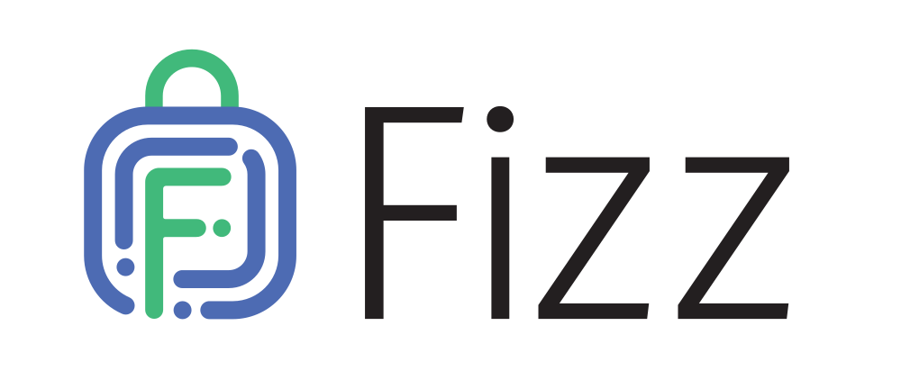

<p align="center">
  
</p>

[](https://opensource.fb.com/support-ukraine)


Fizz is a TLS 1.3 implementation.

Fizz currently supports TLS 1.3 drafts 28, 26 (both wire-compatible with the
final specification), and 23. All major handshake modes are supported, including
PSK resumption, early data, client authentication, and HelloRetryRequest.

More background and details are available on the
[Facebook Code Blog](https://engineering.fb.com/2018/08/06/security/fizz/).

## Dependencies

Fizz largely depends on three libraries: [folly](https://www.github.com/facebook/folly),
[OpenSSL](https://www.openssl.org/), and [libsodium](https://github.com/jedisct1/libsodium).

## Source Layout
- `fizz/crypto`:   Cryptographic primitive implementations (most are wrapping
                   OpenSSL or libsodium)
- `fizz/record`:   TLS 1.3 record layer parsing
- `fizz/protocol`: Common protocol code shared between client and server
- `fizz/client`:   Client protocol implementation
- `fizz/server`:   Server protocol implementation
- `fizz/tool`:     Example CLI app source

## Design

The core protocol implementations are in `ClientProtocol` and `ServerProtocol`.
`FizzClientContext` and `FizzServerContext` provide configuration options.
`FizzClient` and `FizzServer` (which both inherit from `FizzBase`) provide
applications with an interface to interact with the state machine.
`FizzClient`/`FizzServer` receives events from the application layer, invokes the
correct event handler, and invokes the application `ActionVisitor` to process the
actions.

`AsyncFizzClient` and `AsyncFizzServer` provide implementations of the folly
`AsyncTransportWrapper` interface. They own an underlying transport (for example
`AsyncSocket`) and perform the TLS handshake and encrypt/decrypt application
data.

## Features

Fizz has several important features needed from a modern TLS library.

### Performance

Fizz supports scatter/gather IO by default via folly's IOBufs, and will encrypt
data in-place whenever possible, saving memcpys. Due to this and several
other optimizations, we found in our load balancer benchmarks that Fizz has 10%
higher throughput than our prior SSL library which uses folly's
[AsyncSSLSocket](https://github.com/facebook/folly/blob/master/folly/io/async/AsyncSSLSocket.h).
Fizz also consumes less memory per connection than AsyncSSLSocket.

### Async by default

Fizz has asynchronous APIs to be able to offload functions like certificate
signing and ticket decryption. The API is based on folly's
[Futures](https://github.com/facebook/folly/tree/master/folly/futures) for painless
async programming.

### TLS features

Fizz supports APIs like exported keying material as well as zero-copy APIs
needed to use TLS in other protocols like QUIC.

### Secure design abstractions

Fizz is built on a custom state machine which uses the power of the C++ type system
to treat states and actions as types of their own. As the code changes, this allows us
to catch invalid state transitions as compilation errors instead of runtime errors and
helps us move fast.

## Sample Applications

Fizz includes an example program that showcases the basic client/server functionality
supported by Fizz. The binary is called `fizz` and it has similar usage to the
`openssl` or `bssl` commands.

For example, to start a TLS server on port 443 with a specified cert:
```sh
fizz server -accept 443 -cert foo.pem -key foo.key
```

Then, on the same host, you can connect with:

```sh
fizz client -connect localhost:443
```

Both ends will echo whatever data they receive and send any terminal input to the
peer. Hitting CTRL+D on either end will terminate the connection.

The source code for this program can be found under `fizz/tool`.

## Building

### Ubuntu 16.04 LTS

To begin, you should install the dependencies we need for build. This largely
consists of [folly](https://github.com/facebook/folly)'s dependencies, as well as
[libsodium](https://github.com/jedisct1/libsodium).

```sh
sudo apt-get install \
    g++ \
    cmake \
    libboost-all-dev \
    libevent-dev \
    libdouble-conversion-dev \
    libgoogle-glog-dev \
    libgflags-dev \
    libiberty-dev \
    liblz4-dev \
    liblzma-dev \
    libsnappy-dev \
    make \
    zlib1g-dev \
    binutils-dev \
    libjemalloc-dev \
    libssl-dev \
    pkg-config \
    libsodium-dev
```

Then, build and install folly:

```sh
git clone https://github.com/facebook/folly
mkdir folly/build_ && cd folly/build_
cmake ..
make -j $(nproc)
sudo make install
```

And lastly, build and install fizz.

```sh
cd ../..
git clone https://github.com/facebookincubator/fizz
mkdir fizz/build_ && cd fizz/build_
cmake ../fizz
make -j $(nproc)
sudo make install
```

### Building on Mac

The following instructions were tested on MacOS High Sierra
with Xcode 9.4.1. They should work with later Xcode versions as well.

Run the helper script from within the `fizz` subdirectory. The helper
script assumes that you have homebrew installed and are using homebrew
as your package manager. To install homebrew use the instructions on
the homebrew [website](https://brew.sh/).

It will install and link the required dependencies and also build folly.
This may take several minutes the first time.

```sh
cd fizz
./mac-build.sh
```

After building, the directory `out/` will contain the libraries as well as
`out/bin` will contain the `ClientSocket` and `ServerSocket` binaries.
Running it again will be faster and only rebuild `fizz`.

You can also install both `fizz` as well as `folly` to a custom directory
using the build script, by supplying an `INSTALL_PREFIX` env var.

```sh
INSTALL_PREFIX=/usr/local ./mac-build.sh
```

You might need to run the script as root to install to certain directories.

## Contributing

We'd love to have your help in making Fizz better. If you're interested, please
read our guide to [guide to contributing](CONTRIBUTING.md)

## License
Fizz is BSD licensed, as found in the LICENSE file.

## Reporting and Fixing Security Issues

Please do not open GitHub issues or pull requests - this makes the problem
immediately visible to everyone, including malicious actors. Security issues in
Fizz can be safely reported via Facebook's Whitehat Bug Bounty program:

https://www.facebook.com/whitehat

Facebook's security team will triage your report and determine whether or not is
it eligible for a bounty under our program.
