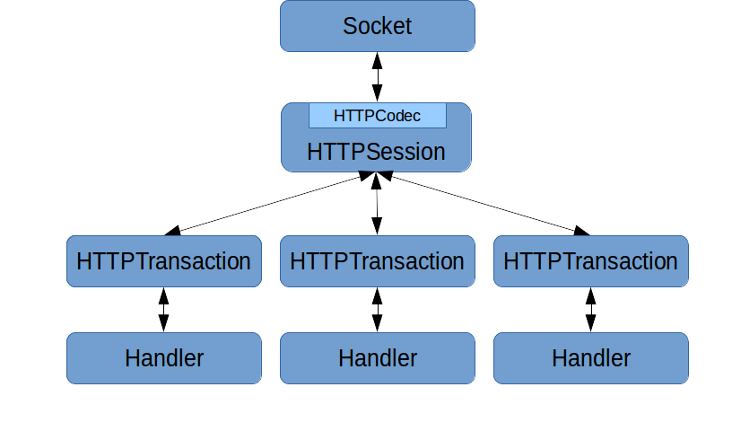

## Proxygen: Facebook's C++ HTTP Libraries

[](https://opensource.facebook.com/support-ukraine)
[](https://github.com/facebook/proxygen/actions?workflow=linux)
[](https://github.com/facebook/proxygen/actions?workflow=mac)

This project comprises the core C++ HTTP abstractions used at
Facebook. Internally, it is used as the basis for building many HTTP
servers, proxies, and clients. This release focuses on the common HTTP
abstractions and our simple HTTPServer framework. Future releases will
provide simple client APIs as well. The framework supports HTTP/1.1,
SPDY/3, SPDY/3.1, HTTP/2, and HTTP/3. The goal is to provide a simple,
performant, and modern C++ HTTP library.

We have a Google group for general discussions at https://groups.google.com/d/forum/facebook-proxygen.

The [original blog post](https://engineering.fb.com/production-engineering/introducing-proxygen-facebook-s-c-http-framework/)
also has more background on the project.

## Learn More in This Intro Video
[](https://www.youtube.com/watch?v=OsrBYHIYCYk)

### Installing

Note that currently this project has been tested on Ubuntu 18.04 and Mac OSX
although it likely works on many other platforms.

You will need at least 3 GiB of memory to compile `proxygen` and its
dependencies.

##### Easy Install

Just run `./build.sh` from the `proxygen/` directory to get and build all
the dependencies and `proxygen`. You can run the tests manually with `cd _build/ && make test`.
Then run `./install.sh` to install it. You can remove the temporary build directory (`_build`) and `./build.sh && ./install.sh`
to rebase the dependencies, and then rebuild and reinstall `proxygen`.

##### Other Platforms

If you are running on another platform, you may need to install several
packages first. Proxygen and `folly` are all Autotools based projects.

### Introduction

Directory structure and contents:

| Directory                  | Purpose                                                                       |
|----------------------------|-------------------------------------------------------------------------------|
| `proxygen/external/`       | Contains non-installed 3rd-party code proxygen depends on.                    |
| `proxygen/lib/`            | Core networking abstractions.                                                 |
| `proxygen/lib/http/`       | HTTP specific code. (including HTTP/2 and HTTP/3)                             |
| `proxygen/lib/services/`   | Connection management and server code.                                        |
| `proxygen/lib/utils/`      | Miscellaneous helper code.                                                    |
| `proxygen/httpserver/`     | Contains code wrapping `proxygen/lib/` for building simple C++ http servers. We recommend building on top of these APIs. |

### Architecture

The central abstractions to understand in `proxygen/lib` are the session, codec,
transaction, and handler. These are the lowest level abstractions, and we
don't generally recommend building off of these directly.

When bytes are read off the wire, the `HTTPCodec` stored inside
`HTTPSession` parses these into higher-level objects and associates with
it a transaction identifier. The codec then calls into `HTTPSession` which
is responsible for maintaining the mapping between transaction identifier
and `HTTPTransaction` objects. Each HTTP request/response pair has a
separate `HTTPTransaction` object. Finally, `HTTPTransaction` forwards the
call to a handler object which implements `HTTPTransaction:: Handler`. The
handler is responsible for implementing business logic for the request or
response.

The handler then calls back into the transaction to generate egress
(whether the egress is a request or response). The call flows from the
transaction back to the session, which uses the codec to convert the
higher-level semantics of the particular call into the appropriate bytes
to send on the wire.

The same handler and transaction interfaces are used to both create requests
and handle responses. The API is generic enough to allow
both. `HTTPSession` is specialized slightly differently depending on
whether you are using the connection to issue or respond to HTTP
requests.



Moving into higher levels of abstraction, `proxygen/HTTP server` has a
simpler set of APIs and is the recommended way to interface with `proxygen`
when acting as a server if you don't need the full control of the lower
level abstractions.

The basic components here are `HTTPServer`, `RequestHandlerFactory`, and
`RequestHandler`. An `HTTPServer` takes some configuration and is given a
`RequestHandlerFactory`. Once the server is started, the installed
`RequestHandlerFactory` spawns a `RequestHandler` for each HTTP
request. `RequestHandler` is a simple interface users of the library
implement. Subclasses of `RequestHandler` should use the inherited
protected member `ResponseHandler* downstream_` to send the response.

### Using it

Proxygen is a library. After installing it, you can build your C++
server. Try `cd` ing to the directory containing the echo server at
`proxygen/httpserver/samples/echo/`.

After building proxygen you can start the echo server with `_build/proxygen/httpserver/proxygen_echo`
and verify it works using curl in a different terminal:
```shell
$ curl -v http://localhost:11000/
*   Trying 127.0.0.1...
* Connected to localhost (127.0.0.1) port 11000 (#0)
> GET / HTTP/1.1
> User-Agent: curl/7.35.0
> Host: localhost:11000
> Accept: */*
>
< HTTP/1.1 200 OK
< Request-Number: 1
< Date: Thu, 30 Oct 2014 17:07:36 GMT
< Connection: keep-alive
< Content-Length: 0
<
* Connection #0 to host localhost left intact
```

You can find other samples:
  * a simple server that supports HTTP/2 server push (`_build/proxygen/httpserver/proxygen_push`),
  * a simple server for static files (`_build/proxygen/httpserver/proxygen_static`)
  * a simple fwdproxy (`_build/proxygen/httpserver/proxygen_proxy`)
  * a curl-like client (`_build/proxygen/httpclient/samples/curl/proxygen_curl`)

### QUIC and HTTP/3

Proxygen supports HTTP/3!

It depends on Facebook's [mvfst](https://github.com/facebook/mvfst)
library for the [IETF QUIC](https://github.com/quicwg/base-drafts) transport
implementation.

This comes with a handy command-line utility that can be used as an HTTP/3
server and client.

Sample usage:
```shell
_build/proxygen/httpserver/hq --mode=server
_build/proxygen/httpserver/hq --mode=client --path=/
```
The utility supports the [qlog](https://github.com/quiclog/internet-drafts)
logging format; just start the server with the `--qlogger_path` option and many
knobs to tune both the quic transport and the http layer.

### Documentation

We use Doxygen for Proxygen's internal documentation. You can generate a
copy of these docs by running `doxygen Doxyfile` from the project
root. You'll want to look at `html/namespaceproxygen.html` to start. This
will also generate `folly` documentation.

### License
See [LICENSE](LICENSE).

### Contributing
Contributions to Proxygen are more than welcome. [Read the guidelines in CONTRIBUTING.md](CONTRIBUTING.md).
Make sure you've [signed the CLA](https://code.facebook.com/cla) before sending in a pull request.

### Whitehat

Facebook has a [bounty program](https://www.facebook.com/whitehat/) for
the safe disclosure of security bugs. If you find a vulnerability, please
go through the process outlined on that page and do not file a public issue.
