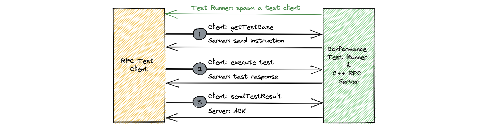

# Client RPC tests
## Framework

The following diagram shows the client RPC conformance test framework.

Client RPC test framework consist of a test runner and a C++ server. Test runner spawns a new test client for the target language and execute the tests. Each test runs in 3 steps.

1. Client connects to the server and fetch the test case with `getTestCase` method. It returns a `RpcTestCase` which contains `ClientInstruction`, which stores input parameters for the next step.
2. Client invokes the actual test method with the input parameters defined in `ClientInstruction`. Server performs instructions defined in `ServerInstruction`. Server stores the result in temporary `ServerTestResult`, and client stores response from test API in temporary `ClientTestResult`.
3. Client sends the stored `ClientTestResult` to server with `sendTestResult` method. Server compares the received `ClientTestResult` from the expected client result in `RpcTestCase`. Server then compares the actual stored `ServerTestResult` from the test method with the expected server test result in `RpcTestCase`.

## Test cases

Test cases below describes available tests, the behavior in step #2, test method invoked by the test client in step #2 and the expected result in `ClientTestResult`.

### Request response

| Test | Description | Expected result in ClientTestResult |
| :--- | :----------- | :---|
| Basic | Client sends a regular request-response request with `RequestResponseBasicClientInstruction.request` and receives the expected result from the server.   `Response requestResponseBasic(1: Request req);` | The response struct |
| Server throws user-declared exception | Client sends a regular request-response request with `RequestResponseDeclaredExceptionClientInstruction.request`, server throws a user-declared exception. Client should catch user exception and send it back to the server using sendTestResult() API.   `void requestResponseDeclaredException(1: Request req) throws (1: UserException e);` | The exception struct |
| Server throws undeclared exception | Client sends a regular request-response request with `RequestResponseUndeclaredExceptionClientInstruction.request`, server throws an undeclared exception in response. Client should catch `TApplicationException` and send exception message back to the server using sendTestResult() API.   `void requestResponseUndeclaredException(1: Request req);` | The exception message string |
| No Argument and void response | Client sends a request-response request with no argument.   `void requestResponseNoArgVoidResponse();` | |
| Fragmentation | NOTE: If the `Basic` test is implemented then this test will automatically run (ie. doesn't require any implementation). Otherwise, this test is not supported.    Client sends a large request-response request (to force fragmentation) with `RequestResponseBasicClientInstruction.request` and server responds with a large response. Client should be able to successfully fragment the request and reassemble the fragmented response. | The response struct |
| Timeout | Client sends a request with `RequestResponseTimeoutClientInstruction.request` and doesn't receive a response from server within `RequestResponseTimeoutClientInstruction.timeOutMs` causing receive timeout to expire. Client should catch `TTransportException`, verify that it's of a `TIMED_OUT` type and aknowledge received exception with the sendTestResult() API.   `Response requestResponseTimeout(1: Request req);`| `TTransportException` raised |

### Streaming

| Test | Description | Expected result in ClientTestResult |
| :--- | :----------- | :---|
| Basic | Client sends a request for a stream with `StreamBasicClientInstruction.request` as the argument. If the language supports setting the chunk/buffer size then a chunk/buffer size of `StreamBasicClientInstruction.bufferSize` must be used. Client must store the stream payloads in `StreamBasicClientTestResult.streamPayloads`.    `stream<Response> streamBasic(1: Request req);` | List of stream payloads received |
| Initial response payload | Client sends a request for a stream with `StreamInitialResponseClientInstruction.request` as the argument. Client must store the initial response in `StreamInitialResponseClientTestResult.initialResponse` and store the stream payloads in `StreamInitialResponseClientTestResult.streamPayloads`.   `Response, stream<Response> streamInitialResponse(1: Request req);` | The first response and the list of stream payloads received |
| Subsequent credits | NOTE: If the `Basic` test is implemented with the chunk/buffer size being set to `StreamBasicClientInstruction.bufferSize` then this test will automatically run (ie. doesn't require any implementation). Otherwise, this test is not supported.    Client initiates a stream and specifies the initial number of credits to be less than the expected number of total credits. Client should be able to send REQUEST_N frames to give the server more credits in order to receive all payloads.  | List of stream payloads received |
| Chunk Timeout | Client sends a request for a stream with `StreamChunkTimeoutClientInstruction.request` as the argument. Client must set a chunk timeout of `StreamChunkTimeoutClientInstruction.chunkTimeoutMs`. Client must store the stream payloads in `StreamChunkTimeoutClientTestResult.streamPayloads`. Client should raise a `TTransportException` while consuming payloads from the stream, if this happens `StreamChunkTimeoutClientTestResult.chunkTimeoutException` must be set to `true`.    `stream<Response> streamChunkTimeout(1: Request req);` | The exception message string. |
| Credit timeout | NOTE: If the language doesn't support setting the chunk/buffer size, this test is not supported.    Client sends a request for a stream with `StreamCreditTimeoutClientInstruction.request` as the argument and sets the chunk/buffer size to `0`. Client then forces a `sleep` for `StreamCreditTimeoutClientInstruction.creditTimeoutMs`. After the sleep, the client should consume payloads from the stream which should raise a `TApplicationException`. If this happens, set `StreamCreditTimeoutClientTestResult.creditTimeoutException` to `true`.    `stream<Response> streamCreditTimeout(1: Request req);` | The exception message string. |
| Fragmentation | NOTE: If the `Basic` test is implemented then this test will automatically run (ie. doesn't require any implementation). Otherwise, this test is not supported.    Client initiates a stream with a large request to force fragmentation and server responds with large stream payloads. Client should be able to fragment the request and reassemble the fragmented responses. | List of stream payloads received |
| Steam Declared Exception | Client sends a request for a stream with `StreamDeclaredExceptionClientInstruction.request` as the argument and start consuming stream payloads. Then, the client catches a `UserException` while consuming payloads and assigns it to `StreamDeclaredExceptionClientTestResult.userException`.    `stream<Response throws (1: UserException e)> streamDeclaredException(1: Request req);` | The `UserException` |
| Steam Undeclared Exception | Client sends a request for a stream with `StreamUndeclaredExceptionClientInstruction.request` as the argument and start consuming stream payloads. Then, the client catches a `TApplicationException` while consuming payloads and assigns the error message to `StreamUndeclaredExceptionClientTestResult.exceptionMessage`.    `stream<Response> streamUndeclaredException(1: Request req);` | The exception message |

### Sink

| Test | Description | Expected result in ClientTestResult |
| :--- | :----------- | :---|
| Basic | Client sends a request for a sink with `SinkBasicClientInstruction.request` as the argument. Client sends all of the payloads in `SinkBasicClientInstruction.sinkPayloads` through the sink to the server. Client then receives a final response from the server and stores it in `SinkBasicClientTestResult.finalResponse`.    `sink<Request, Response> sinkBasic(1: Request req);` | The final response |
| Subsequent credits | NOTE: If the `Basic` test is implemented then this test will automatically run (ie. doesn't require any implementation). Otherwise, this test is not supported.    Client initiates a sink and sends more sink payloads than the buffer specified on the server. Client should be able to receive and interpret REQUEST_N frames from the server in order to be able to send all sink payloads.  | The final response |
| Fragmentation | NOTE: If the `Basic` test is implemented then this test will automatically run (ie. doesn't require any implementation). Otherwise, this test is not supported.    Client initiates a sink with a large request and sends large sink payloads to force fragmentation and server responds with a large final response. Client should be able to fragment the request and reassemble the fragmented response. | The final response |

### Interactions

| Test | Description | Expected result in ClientTestResult |
| :--- | :----------- | :---|
| Constructor | Client creates a `BasicInteraction` using the constructor and sends a request to `BasicInteraction.init()` (so the constructor is called on the server). | N/A |
| Factory function | Client creates a `BasicInteraction` using the factory function (`basicInteractionFactoryFunction(i32 initialSum)`). The `initialSum` argument must be `InteractionFactoryFunctionClientInstruction.initialSum`. | N/A |
| Persists state | Client creates a `BasicInteraction` using the constructor if `InteractionPersistsStateClientInstruction.initialSum` is not set, otherwise, the client creates a `BasicInteraction` using the `basicInteractionFactoryFunction(i32 initialSum)` factory function using `InteractionPersistsStateClientInstruction.initialSum` as the `initialSum` argument. Then, the client iterates through `InteractionPersistsStateClientInstruction.valuesToAdd` and sends a request to `BasicInteraction.add(1: i32 i)` in each iteration with the `i` argument being the current value from the `valuesToAdd` list. Each response must be appended to `InteractionPersistsStateClientTestResult.responses`. | All responses from `BasicInteraction.add(1: i32 i)` |
| Termination | Client creates a `BasicInteraction` using the constructor if `InteractionPersistsStateClientInstruction.initialSum` is not set, otherwise, the client creates a `BasicInteraction` using the `basicInteractionFactoryFunction(i32 initialSum)` factory function using `InteractionPersistsStateClientInstruction.initialSum` as the `initialSum` argument. Then, the client sends a request to `BasicInteraction.init()`. | N/A |
