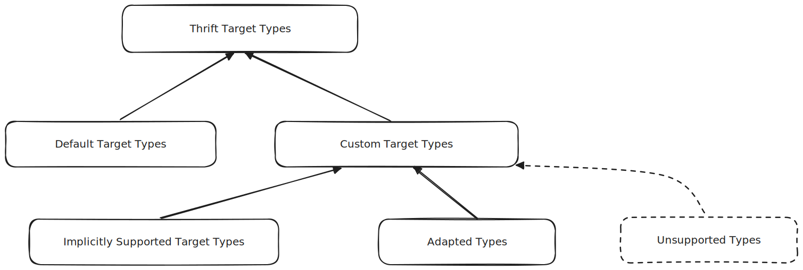

# Kinds of Types

## Overview

As a framework whose core mission is to enable safe and efficient
interoperability between heterogeneous actors, Thrift naturally relies
significantly on *types*. At each level, from the source IDL files to the
code generated by the Thrift compiler in target programming languages and
ultimately the serialized representation of data (for storage or transmission),
appropriate types are defined and used to capture the structure and operations
of the corresponding data.

This section defines the terminology used to refer to the different types
involved, to clarify their respective expectations and facilitate documentation
and user support by providing a common, unambiguous understanding.

## Taxonomy

### Thrift IDL Types

*Thrift IDL types* are language-agnostic types that are defined by the formal
Thrift Interface Definition Language (IDL) specification or in (typically,
user-provided) source `.thrift` files.

Ultimately, every valid piece of data in the Thrift ecosystem (and every other
type listed below) must resolve to a Thrift IDL type.

The authoritative reference for Thrift IDL Types can be found in
[IDL > Types](../idl/index.md#types), which is summarized below for convenience:

#### Categories

There are three high-level categories of Thrift IDL types:
  1. [Primitive](../idl/index.md#primitive-types): `i32`, `bool`, `string`, ...
  2. [Container](../idl/index.md#container-types): `list<T>`, `map<K, V>`, and
     `set<T>`
  3. [Named](../idl/index.md#named-types) (also known as "user-defined"):
     `struct`, `union`, `exception` and `enum`.

#### Aliases

Thrift IDL files also support type aliases, which are defined in
[IDL > Definitions > Typedefs](../idl/index.md#typedefs). Some relevant
properties are summarized below for convenience:

* A type alias (i.e., "typedef") always resolves (eventually) to exactly one
  Thrift IDL type (from one of the categories above).
* While annotations may affect the native target type corresponding to an
  aliased type, they do not change the Thrift IDL type being aliased.

  For example, at the Thrift IDL level, the following typedefs both resolve to
  the same exact type (in this case, `i64`):

  ```thrift
  typedef i64 LongInteger

  @cpp.Type{name = "uint64_t"}
  typedef i64 UnsignedLongInteger
  ```

### Thrift Target Types

Target types are language-specific, and are therefore defined and used in the
context of a specific target language (eg. `std::string` in C++ or
`java.lang.String` in Java). They can also be referred to as "native types".

These are the types used in code generated by the thrift compiler, however not
every native type is relevant or valid to use with Thrift. The set of all
possible native types can therefore be categorized as shown below.:


<!-- Diagram source: ../assets/thrift_native_types.excalidraw -->


#### Default Target Types

Default target types are are the ones used by default by the Thrift compiler for
the corresponding target generated language. They are obviously supported by
Thrift, and are the ones used unless the user explicitly specifies otherwise
(typically, through annotations).

For example, here are a few of the default types for the C++ target language:

| Thrift IDL type | C++              |
| ---             | ---              |
| `string`        | `std::string`    |
| `i32`           | `int32_t`        |
| `i64`           | `int64_t`        |
| `map<K, V>`     | `std::map<K, V>` |
| `set<K>`        | `std::set<K>`    |

:::note
Past documents and APIs sometimes refer to Thrift default types as "standard
types".
:::

#### Custom Target Types

Every other Thrift target type (i.e, that is not a default type) is a *custom
type*. It is only used if the user explicitly requests it (and subject to the
custom specified type being properly supported and *compliant* with the
corresponding operations, such as serialization/deserialization).

:::note
In opposition to Thrift default types, which are also known as "standard types",
custom types are sometimes referred to as "non-standard types".
:::

#### Implicitly Supported Target Types

The Thrift compiler and runtime libraries MAY provide implicit support for a few
key types beyond the ones that are used by default. These typically aim to
provide opt-in behavior that may be critical or widely useful to users.

Support for these types is either provided through extensive ad-hoc logic in the
Thrift code, or implicitly through well defined *traits*. Historically, these
types have also been referred to as "built-in types".

For example, in C++, Thrift has built-in support for `folly::IOBuf`, to enable
zero-copy manipulation of binary fields. Enabling it requires explicit
annotation in the Thrift IDL (eg. `@cpp.Type{name = "folly::IOBuf"}`), but
compliance and support for this type is extensively built into (and supported
by) Thrift.

Similarly, in C++, the expected behavior and interactions with native types
corresponding to IDL container types (`map<K, V>`, `set<T>`, `list<T>`) are well
(albeit somewhat implicitly) established in terms of the common traits of the
corresponding STL types (`std::map`, `std::set`, `set::vector`). Users can use
custom, non-standard native types that satisfy these traits by explicitly
annotating the correspodning IDL fields or types (eg.
`@cpp.Type{template = "std::unordered_set"}`)


Well-known non-standard native types with built-in support (per target language)
include:
* In C++:
    * `folly::IOBuf`, `std::unique_ptr<folly::IOBuf>`
    * Containers that satisfy similar STL traits, eg:
        * `folly::F14FastMap`, `folly::F14NodeMap`
        * `folly::sorted_vector_map`
        * `std::unordered_map`, `std::unordered_set`


#### Adapted Types

Custom target types that are not implicitly supported can still be made
compliant with Thrift, if users explicitly provide a suitable adapter.

[Thrift Adapters](../features/adapters.md) provide a standard and
well-documented mechanism for users to make custom native types compliant (and
usable) with Thrift, for all officially supported target languages. A custom
native type made compliant with Thrift through this mechanism is referred to as
an **adapted type**. Every adapted type has an *underlying type*, which is the
type that the adapter converts to/from the adapted type. The underlying type is
one of the following:
1. if multiple adapter are [composed](../features/adapters.md#compose), the
   underlying type is the adapted type of the nested adapter, otherwise
2. the underlying type is the (typically, default) type being adapted.

#### Unsupported Types

All other native types do not satisfy the conditions needed to be compliant with
Thrift, and should not be used in any Thrift IDL or generated code. These are
not technically "Thrift types", but are mentioned here for completeness (i.e.,
every native type in a given target language should be covered by the categories
above).


### Thrift Wire Types
Types used by (de)serializers to encode or decode an instance of a Thrift IDL
type to and from a serialized representation.

The exact set of wire types depends on the serialization protocol. The main
officially supported protocols are the Binary and Compact protocols, whose
corresponding wire types are documented
[here](../features/serialization/protocols.md#thrift-types).

Despite the lack of official support, various JSON serialization protocols have
been implemented and used over time (eg. `SimpleJSON`), whose wire types should
correspond to the [JSON standard](https://www.json.org/), i.e. object, array,
number, string, `true`, `false`, or `null`.

:::caution
In practice, all known used JSON serialization protocols do not fully comply
with the official JSON specifications. For instance, due to the fact that the
Thrift IDL `map<K, V>` type allows structured types to be used as keys, but JSON
does not have similar support for `object` keys. Unicode support for strings has
also been known to be incomplete.
:::
