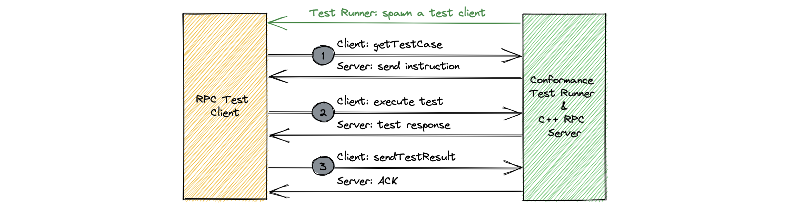

# Client RPC tests
## Framework

The following diagram shows the client RPC conformance test framework.

Client RPC test framework consist of a test runner and a C++ server. Test runner spawns a new test client for the target language and execute the tests. Each test runs in 3 steps.

1. Client connects to the server and fetch the test case with `getTestCase` API. It returns a `ClientInstruction` union which contains a struct for each test case. Instruction struct contains input parameters for the next step.
2. Client invokes the actual test API with the input parameters provided in step #1.
3. Client invokes `sendTestResult` API with `ClientTestResult` parameter and sends the received response in step #2 back to the server.

## Test cases

Test cases below describes available tests, the behavior in step #2, test API invoked by the test client in step #2 and the expected result in `ClientTestResult`.

### Request response

| Test | Description | Expected result in ClientTestResult |
| :--- | :----------- | :---|
| Basic | Client sends a regular request-response request and receives the expected result from the server.   `Response requestResponseBasic(1: Request req);` | The response struct |
| Server throws user-declared exception | Client sends a regular request-response request and server decides to throw a user-declared exception. Client should surface this as the Thrift struct representing the user-declared exception.   `void requestResponseDeclaredException(1: Request req) throws (1: UserException e);` | The exception struct |
| Server throws undeclared exception | Client sends a regular request-response request and server decides to throw an undeclared exception. Client should surface this as a TApplicationException containing the error message from the server.   `void requestResponseUndeclaredException(1: Request req);` | The exception message string |
| No Argument and void response | Client sends a request-response request with no argument.   `void requestResponseNoArgVoidResponse();` | |
| Fragmentation | Client sends a large request-response request (to force fragmentation) and server responds with a large response. Client should be able to successfully fragment the request and reassemble the fragmented response.   `Response requestResponseBasic(1: Request req);` | The response struct |
| Timeout | Client sends a request and doesn't receive a response from server causing receive timeout to expire. Client should raise a TTransportException with type TIMEOUT.   `Response requestResponseTimeout(1: Request req);`| TTransportException raised |

### Streaming

| Test | Description | Expected result in ClientTestResult |
| :--- | :----------- | :---|
| Basic | Client initiates a stream and receives payloads/completion from server.   `stream<Response> streamBasic(1: Request req);` | List of stream payloads received |
| Initial response payload | Client initiates a stream that is defined to also return a payload on the first response.   `Response, stream<Response> streamInitialResponse(1: Request req);` | The first response and the list of stream payloads received |
| Subsequent credits | Client initiates a stream and specifies the initial number of credits to be less than the expected number of total credits. Client should be able to send REQUEST_N frames to give the server more credits in order to receive all payloads.    | List of stream payloads received |
| Chunk Timeout | Client initiates a stream and waits for the chunk timeout to expire, causing it to raise TTransportException.   `stream<Response> streamChunkTimeout(1: Request req);` | The exception message string. |
| Credit timeout | Client initiates a stream and forces server to consume all of its credits without receiving any credits from the client (ie. doesn't send any REQUEST_N frames), causing the server to send a credit timeout to the client.   `stream<Response> streamCreditTimeout(1: Request req);` | The exception message string. |
| Fragmentation | Client initiates a stream with a large request to force fragmentation and server responds with a large first response as well as large stream payloads. Client should be able to fragment the request and reassemble the fragmented responses.   `Response, stream<Response> streamInitialResponse(1: Request req);` | The first response and the list of stream payloads received |

### Sink

| Test | Description | Expected result in ClientTestResult |
| :--- | :----------- | :---|
| Basic | Client initiates a sink, sends payloads to server, completes the sink, and receives a final response from the server.    `sink<Request, Response> sinkBasic(1: Request req);` | The final response |
