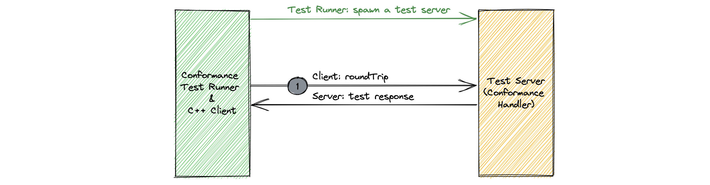

# Data tests

## Framework
The following diagram shows data conformance test framework.

Data conformance test framework consist of a test runner and a C++ client. Test runner spawns a new test server (conformance handler) for the target language and execute the tests. All tests are executed in a single step. Test client invokes `roundTrip` API with `RoundTripRequest` input parameter. This contains an `Any` struct and an optional target protocol. Server decodes the `Any` request and encodes it back to the `RoundTripResponse` using target protocol - if not empty - or using the protocol in Any.

## Test cases

### Consistency Tests

All languages must be able to represent and correctly round trip all valid Thrift values. Note that not all target languages may be able to natively represent all valid Thrift values. However, these values still must roundtrip successfully. Known representational limitations include:

| Limitation | Language | Notes |
| :--- | :----------- | :---- |
| Set values and map keys | Hack | String, binary and integer only |
| | C++ | Undefined behavior for NaN |
| | Java | -0.0 < 0.0 when boxed |
| | Python | NaN falls back on object identity in sets |
| Enum values | Java | Unknown enum values can only be represented by an int |

It is impractical to verify conformance for all valid Thrift values, so only a subset of all valid values are verified. Here are some important values for which conformance is tested.

| Type | Value |
| :--- | :----------- |
| primitive | default |
| numeric | max |
| numeric | min |
| double | 0 |
| double | +inf |
| double | -inf |
| double | 2^53 - 1 |
| double | 2^53 |
| double | 2^53 +1 |
| double | NaN |
| double | subnormal value |
| enum | known value |
| enum | known 0 value |
| enum | known negative value |
| enum | unknown value |
| enum | unknown 0 value |
| enum | unknown negative value |
| enum | default when no known 0 value |
| binary | Invalid UTF8 |
| list<type\> | <empty\> |
| list<type\> | containing all values listed for <type\> |
| set<type\> | <empty\> |
| set<type\> | containing all values listed for <type\> |
| set<double\> | {NaN} |
| set<double\> | {NaN} ∪ {NaN} |
| set<double\> | {0.0} ∪ {-0.0} |
| set<double\> | {-0.0} ∪ { 0.0} |
| map<key, value\> | <empty\> |
| map<key, value\> | containing all values listed for <key\> and <value\> |
| struct | with a field for all values listed |
| union | with a field for all values listed |
| struct w/ optional | unset for all types |
| struct w/ optional | set to all values listed for <type\> |
| nested struct | A struct defined in another struct |

### Compatibility Tests

The tables below list the test cases for compatibility.

#### Types
Supported conversions.

| From | To | Notes |
| :--- | :--- | :--- |
| integer | larger integer | error |
| integer | smaller integer | error |
| string | binary | allowed |
| binary | string | error if not valid UTF8 |
| enum | integer | treats enum as i32 |
| integer | enum | treats enum as i32 |
| set | list | error |
| list | set | error |
| set<pair\> | map | error |
| list<pair\> | map | error |

All other conversions produce an error when deserializing.

#### Structs
The following outlines the compatibility for changes to structured types.

| Change | Wire compatible | Code compatible | Notes |
| :--- | :--- | :--- | :--- |
| Add a field | yes | yes | Dropped by old |
| Remove a field | yes | no | Dropped by new |
| Rename a field | yes | no | Only affect code gen and text format |
| Change field type | rarely | no | See 'Types' |
| Add enum value | yes | yes | Preserved by old |
| Remove enum value | yes | no | Preserved by new |
| Default changed | yes | yes | Old default in old, new default in new |
| Default changed on an optional field | yes | yes | Old default in old, new default in new |
| Default on new non-optional field | yes | yes | Gets new default |
| Default on new optional field | yes | yes | Stays unset |
| New enum field with no 0 value | yes | yes | |
| Constant changed | yes | yes | Old constant in old, new constant in new |
| Required to unspecified | yes | no | |
| Unspecified to required | yes | no | |
| Optional to unspecified | yes | no | |
| Unspecified to optional | yes | no | |
| Optional to required | yes | no | |
| Required to optional | yes | no | |
| Struct to union | no | no | |
| Union to struct | no | no | |
| Struct to exception | yes | yes | |
| Exception to struct | yes | yes | |
| Union to exception | no | no | |
| Exception to union | no | no | |
| Singular to container | no | no | |
| Container to singular | no | no | |

### Tolerance Tests

The tables below list the test cases for tolerance.

| Issue |
| :--- |
| Union with multiple fields set |
