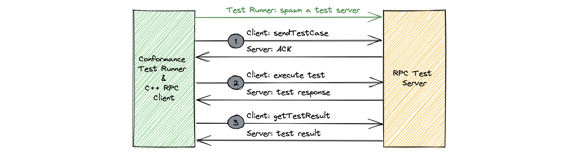

# Server RPC tests
## Framework
The following diagram shows the server RPC conformance test framework.

Server RPC test framework consist of a test runner and a C++ client. Test runner spawns a new test server for the target language and execute the tests. Each test runs in 3 steps.

1. Client notifies the server with the `sendTestCase` API, sends `RpcTestCase` which contains `ServerInstruction`. Server **should** store `RpcTestCase` temporarily for the next step.
2. Client executes the test with an optional parameter defined in `ClientInstruction`. Server performs instructions defined in `ServerInstruction`. Server stores the result in temporary `ServerTestResult`, and client stores response in temporary `ClientTestResult`.
3. Client compares the `ClientTestResult` from the expected `RpcTestCase` and actual result from server. Client requests server for stored `ServerTestResult` with `getTestResult` method. Server responds with stored `ServerTestResult` from step #2. Client compares it with `ServerTestResult` from the expected `RpcTestCase`.

Note that, the server stores state between each test steps. Some servers (i.e Hack) may not store state as each of the steps may go to a different instance of the servers. A stateless version which merge 3 steps into one is also available. This might have some limitation for the test cases though, i.e if the server has to be configured before step #2.

## Test cases
Test cases below describes available tests, the behavior in step #2, test API invoked by the test client in step #2 and the expected result in `ServerTestResult`.

### Request response

| Test | Description | Expected result in ServerTestResult |
| :--- | :----------- | :---|
| Basic | Server receives a request-response request from a client and runs the corresponding RPC handler for the RPC specified in the request and sends back the response defined in `RequestResponseBasicServerInstruction.response`.   `Response requestResponseBasic(1: Request req);` | Initial request |
| Server throws user-declared exception | Server receives a request-response request from a client, runs the RPC handler for the method specified in the request, the handler throws a user-declared exception defined in `RequestResponseDeclaredExceptionServerInstruction.userException`.   `void requestResponseDeclaredException(1: Request req) throws (1: UserException e,);` | Initial request |
| Server throws undeclared exception | Server receives a request-response request from a client, runs the RPC handler for the method specified in the request, the handler throws a runtime exception with `RequestResponseUndeclaredExceptionServerInstruction.exceptionMessage` which is serialized as a `TApplicationException` and sent to the client.   `void requestResponseUndeclaredException(1: Request req);` | Initial request |
| No Argument and void response | Server receives a request with no argument, and response with a void response.   `void requestResponseNoArgVoidResponse();` | |
| Fragmentation | NOTE: If the `Basic` test is implemented then this test will automatically run (ie. doesn't require any implementation). Otherwise, this test is not supported.    Server receives fragmented request-response request and sends a large response utilizing fragmentation. | Initial request |

### Streaming

| Test | Description | Expected result in ServerTestResult |
| :--- | :----------- | :---|
| Basic | Server receives a stream request from a client and stores it in `StreamBasicServerTestResult.request`. Server then sends stream payloads defined in `StreamBasicServerInstruction.streamPayloads` and completes the stream.   `stream<Response> streamBasic(1: Request req);`| Initial request |
| Initial response payload | Server receives a stream request from a client and stores it in `StreamInitialResponseServerTestResult.request`. Server then sends the initial response defined in `StreamInitialResponseServerInstruction.streamInitialResponse` and sends the stream payloads defined in `StreamInitialResponseServerInstruction.streamPayloads` and completes the stream.   `Response, stream<Response> streamInitialResponse(1: Request req);` | Initial request |
| Subsequent credits | NOTE: If the `Basic` test is implemented then this test will automatically run (ie. doesn't require any implementation). Otherwise, this test is not supported.    Client initiates a stream and specifies the initial number of credits to be less than the expected number of total credits. Server should be able to receive REQUEST_N frames to add credits in order to send all payloads.  | Initial request |
| Credit timeout | NOTE: This is not supported yet.    Server receives a stream request from a client and sends payloads until it has no credits remaining, at which point the credit timeout will begin and eventually expire, causing the server to send a credit timeout exception and closing the stream.   `stream<Response> streamCreditTimeout(1: Request req);` | Initial request |
| Fragmentation | NOTE: If the `Basic` test is implemented then this test will automatically run (ie. doesn't require any implementation). Otherwise, this test is not supported.    Client initiates a stream with a large request to force fragmentation and server responds with large stream payloads. Server should be able to reassemble the fragmented request and fragment the large responses. | Initial request |

### Sink

| Test | Description | Expected result in ServerTestResult |
| :--- | :----------- | :---|
| Basic | Server receives a sink request from a client and stores it in `SinkBasicServerTestResult.request`. Server must set the buffer size to `SinkBasicServerInstruction.bufferSize` and store the sink payloads it receives from the client in `SinkBasicServerTestResult.sinkPayloads`. Server must send the final response defined in `SinkBasicServerInstruction.finalResponse` to the client.   `sink<Request, Response> sinkBasic(1: Request req);` | Initial request and received payloads |
| Chunk timeout | Server receives a sink request from a client and stores it in `SinkChunkTimeoutServerTestResult.request`. Server must set the chunk timeout to `SinkChunkTimeoutServerInstruction.chunkTimeoutMs`. While the server is consuming sink payloads from the client, a `TApplicationException` should get raised after the chunk timeout expires (since client is not sending any payloads). If the exception is raised, `SinkChunkTimeoutServerTestResult.chunkTimeoutException` should be set to `true`.    `sink<Request, Response> sinkChunkTimeout(1: Request req);` | Initial request, received payloads and chunk timeout flag |
| Subsequent credits | NOTE: If the `Basic` test is implemented then this test will automatically run (ie. doesn't require any implementation). Otherwise, this test is not supported.    Client initiates a sink and sends more sink payloads than the buffer specified on the server. Server should be able to send REQUEST_N frames to the client to give the client more credits in order to be able to receive all sink payloads.  | Initial request and received payloads |
| Fragmentation | NOTE: If the `Basic` test is implemented then this test will automatically run (ie. doesn't require any implementation). Otherwise, this test is not supported.    Client initiates a sink with a large request and sends large sink payloads to force fragmentation and server responds with a large final response. Server should be able to reassemble the fragmented request and sink payloads and fragment the large final response. | Initial request and received payloads |
