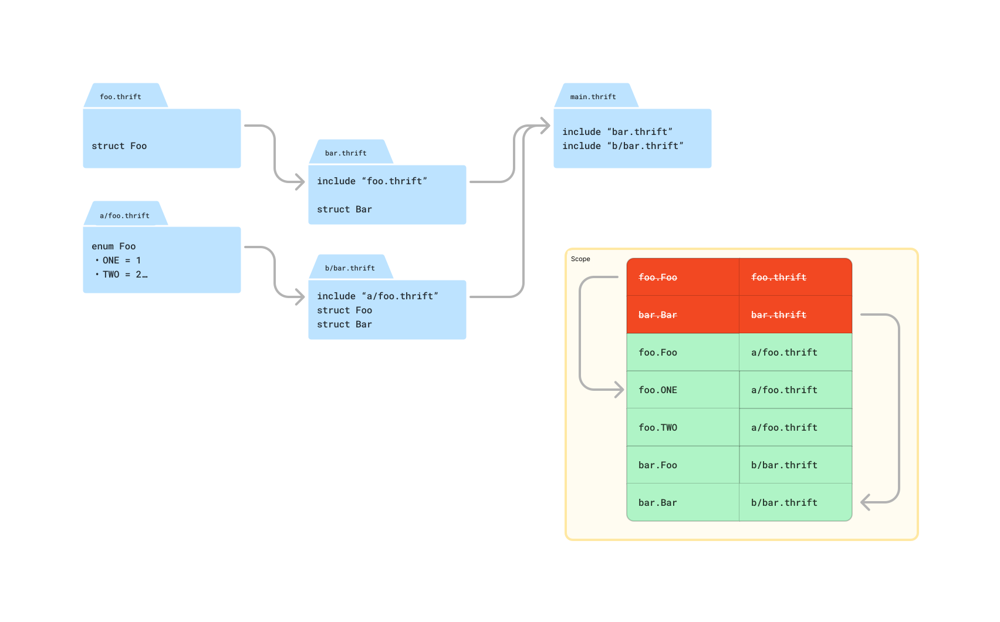
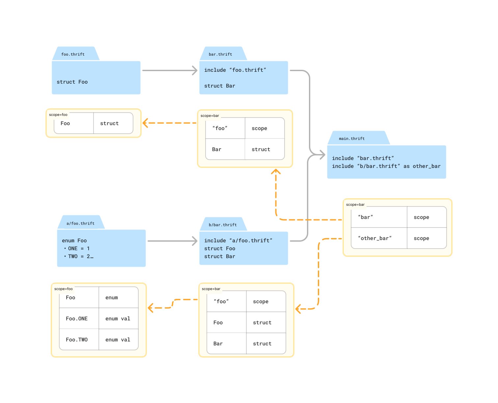

# Resolving identifiers

## Scope

Each thrift program, i.e. a `.thrift` file, provides a namespace for the definitions specified within it, hereby referred to as a `scope`. This scope is used to isolate definitions between programs & to allow referring to definitions between programs.

The following is an example thrift program defined in `a/b/c/foo.thrift`
```thrift
> a/b/c/foo.thrift

struct Message {
    1: string text;
}

enum MessageType {
    HI = 1,
    HELLO = 2,
    BONJOUR = 3
}

const i32 MAX_MESSAGES = 10;
```

The program provides three definitions within its scope, e.g.
- struct `Message`
- enum `MessageType`
- i32 constant `MAX_MESSAGES`

The definitions provided by `a/b/c/foo.thrift` can be used by another program by including it & prefixing the types using the `scope` name, e.g.
```thrift
> module.thrift

include "a/b/c/foo.thrift"

struct MyMessage {
    1: foo.Message msg;
}
```

## Identifiers

The Thrift IDL allows specifying three types of [identifiers](./index.md#identifiers):
- `Unqualified` identifiers, e.g. `Foo`
- `Qualified` identifiers, e.g. `foo.Bar`
- `Fully-qualified` identifiers, e.g. `foo.Bar.Baz`

### Unqualified identifiers

`Unqualified` identifiers can only refer to definitions in the local scope.

```thrift
struct Foo {}

struct Bar {
    1: Foo foo; # Definitions be declared before usage
    2: Baz baz; # or after
}

struct Baz {}
```

### Qualified identifiers

`Qualified` identifers are considered *potentially scoped* as they can be interpreted in multiple ways.
They can refer to enum values, as enum values can (& should) specify the enum name, e.g.

```thrift
enum MyEnum {
    A = 1,
    B = 2
}

const MyEnum B_VALUE = MyEnum.B;
```

The usage of `MyEnum.B` has the same form as a definition if `B` within a `MyEnum` scope, e.g.

```thrift
> a/b/c/MyEnum.thrift

const i32 B = 15;
```

Therefore qualified identifiers of the form `<X>.<Y>` are either:
- `unscoped` values `<Y>` of an enum `<X>` defined within the local scope
- `scoped` definition of `<Y>` as declared within a program with scope `<X>`

:::caution
The `scoped` definition currently allows specifying a scoped enum value directly, omitting the enum name. e.g. `foo.MY_ENUM_VALUE`. This works unless the enum value is ambiguous without explicitely specifying the enum name. Always prefer to directly specify the enum name. See [Deprecated rules](#deprecated-rules) for more info.
:::

### Fully-qualified identifiers

`Fully qualified identifiers` can only refer to enum values. They take the form of `<scope>.<enum_name>.<value_name>` & refer to an enum definition `<enum_name>` with a value of `<value_name>` as declared within a scope named `<scope>`. E.g.

```thrift
> foo.thrift

enum Bar {
    A = 1,
    B = 2,
    C = 3
}

> module.thrift
include "foo.thrift"

const foo.Bar B_VALUE = foo.Bar.B;
```

## Resolution rules

:::caution
These rules are currently being changed in order to remove ambiguity in the resolution rules, see the [Resolution 2.0](#resolution-20) section for more info
:::

The identifier resolution mechanism in thrift works by flattening the entire thrift hierarchy for a program into a single-level scope, referred to as the `global scope`. Each definition provided by a program is added to the scope using the filename of the program as the `scope` name, e.g.
`a/b/c/foo.thrift` will add any definition it contains as `foo.<definition_name>`.

Unfortunately this isn't sufficient to isolate & disambiguate definitions between scopes, as multiple programs can provide the same scoped definitions, e.g. `a/b/c/foo.thrift` & `d/e/f/foo.thrift` will both introduce definitions in the form of `foo.<definition_name>`. When multiple definitions overlap, the resulting behavior is that definitions introduced later on override prior definitions.



The order in which programs add definitions to the global scope is *depth-first*, meaning a program will process its includes before adding any local definitions. In addition, programs are only processed once for every compiler invocation. This means that determining the resolved definition for an identifier from the perspective of a single program is often hard or impossible.

The following example shows that a program cannnot rely on the order of its includes to determine which definition an identifier will resolve to when multiple scopes provide the same definition.
```thrift
> a/b/c/foo.thrift

struct Bar { ... }

> d/e/f/foo.thrift
include "other/foo.thrift"

struct Bar { ... }

> other/foo.thrift

struct Bar { ... }

> main.thrift
include "a/b/c/foo.thrift"
include "d/e/f/foo.thrift"
include "other/foo.thrift"

struct S {
    1: foo.Bar bar; # Refers to d/e/f/foo.thrift::Bar
}
```

### Include aliases

Include statements that provide an [alias](./index.md#include-aliases) do not use the global scope to resolve identifiers. Instead, they directly resolve to a definition provided explicitely by the scope referred to by the alias name. This makes include aliases immune to definition overrides by other programs (in the local program). In addition, include aliases do not populate items in the global scope, meaning they do not expose definitions to other programs.

```thrift
> a/foo.thrift

struct Bar { ... }

> b/foo.thrift

struct Bar { ... }

> global.thrift
include "a/foo.thrift"
include "b/foo.thrift"

struct S {
    1: foo.Bar field; # Is always b/foo.thrift::Bar
}

> alias.thrift
include "a/foo.thrift" as A_Foo
include "b/foo.thrift"

struct S {
    1: A_Foo.Bar field_a; # Is a/foo.thrift::Bar
    1: foo.Bar field_b; # Is b/foo.thrift::Bar
}
```

## Resolution 2.0

In order to disambiguate the resolution of thrift identifiers, each identifier should only be resolvable via a single scope.
Each program's scope can only access definitions inside scopes through direct includes (without any overrides due to transitively included programs).



This requires deprecatation of the following set of rules.

### Deprecated rules

:::caution
The following is a list of resolution rules that work due to historical reasons. These are currently being deprecated & support for them is being removed.
See each section for examples on how to remedy these.
:::

### Using enum values without an enum name

Enum values can currently be used without specifying the appropriate enum name, e.g.
```thrift
> foo.thrift
enum Bar {
    A = 1,
    B = 2
}

> module.thrift
include "foo.thrift"

enum Baz {
    ONE = 1,
    TWO = 2
}

const Bar VALUE_OF_A = foo.A;  # instead of foo.Bar.A
const Baz VALUE_OF_ONE = ONE; # instead of Baz.ONE
```

This is valid as long as there is no other definition of the enum value exist within the provided scope.

:::caution
An enum value of `UNKNOWN` is exempt from this ambiguity check is always allowed without providing the enum name. This was (presumably) done with the assumption that `UNKNOWN` is always value `0`. However this is not always the case & should be considered **extremely dangerous**.
:::

Instead enum values should always be fully qualified:
```thrift
> module.thrift
include "foo.thrift"

enum Baz {
    ONE = 1,
    TWO = 2
}

const Bar VALUE_OF_A = foo.Bar.A;
const Baz VALUE_OF_ONE = Baz.ONE;
```

### Specifying the local program's name as the scope

Within any given program, for any definition within that program it is possible to refer to that definition as `<filename>.<definition_name>`. This is inherently an artifact of resolving identifiers via the [Global scope](#scope).

```thrift
> foo.thrift

struct S { ... }

struct Foo {
    1: foo.S field; # Refers to struct S above
}
```

Instead, local definitions should be accessed using a scope name:
```thrift
> foo.thrift

struct S { ... }

struct Foo {
    1: S field;
}
```

### Including multiple programs with the same scope name

A program can currently specify multiple includes that result in the same scope name.
These are resolved using the [global scope rules](#resolution-rules), with a last-definition wins
outcome for when definition overlap exists.

```thrift
include "a/b/c/foo.thrift"
include "d/e/f/foo.thrift"

struct S {
    1: foo.Bar bar;
}
```

Instead, each included scope should be accessible using a unique name. One (or more) of the includes can be aliased in order to guarantee uniqueness for each scope.

```thrift
include "a/b/c/foo.thrift" as ABC_Foo
include "d/e/f/foo.thrift" as DEF_Foo

struct S {
    1: ABC_Foo.Bar abc_bar;
    2: DEF_Foo.Bar def_bar;
}
```

### Indirect access to scopes or definitions

Being able to resolve definitions via transitive includes is generally reported as an error for most type definitions, but is still valid when used with constants, structured annotations & struct literals.

```thrift
> other/foo.thrift

const i32 VALUE = 42;

struct Bar { ... }

> foo.thrift
include "other/foo.thrift"

> module.thrift
include "foo.thrift"

struct MyValue {
  1: i32 val;
}

@MyValue{val = foo.VALUE}  # Transitively included by foo.thrift
struct A {}

const i32 B = foo.VALUE; # Transitively included by foo.thrift

struct C {
  1: i32 val = foo.VALUE; # Transitively included by foo.thrift
}
```

Instead, all scopes used by a program should have a direct include, potentially adding an alias to prevent duplicate scope names:

```thrift
> module.thrift
include "foo.thrift"
include "other/foo.thrift" as OtherFoo

struct MyValue {
  1: i32 val;
}

@MyValue{val = OtherFoo.VALUE}
struct A {}

const i32 B = OtherFoo.VALUE;

struct C {
  1: i32 val = OtherFoo.VALUE;
}
```
