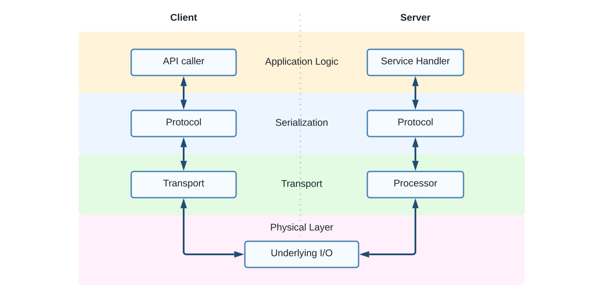

# Introduction

Thrift is a serialization and [RPC](https://en.wikipedia.org/wiki/Remote_procedure_call)
(Remote Procedure Call) framework for service communication. Thrift enables
these features in all major languages with strong support for C++, Python, Hack,
and Java. Most services at Meta are written using Thrift for RPC, and some
storage systems use Thrift for serializing records on disk.
Our version, [FBThrift](https://github.com/facebook/fbthrift), is based on
[Apache Thrift](https://thrift.apache.org/), and is open sourced. At a high level, Thrift
has three major components:

## A Code Generator

Thrift has a code generator which generates data structures that can be
serialized using Thrift, and client and server stubs for RPC, in different
languages.

<!-- Diagram source: assets/codegen.vsdx (created with Lucid Charts). -->

## A Serialization Framework

Thrift has a set of protocols for serialization that may be used in different
languages to serialize the generated structures created from the code generator.

## An RPC Framework

Thrift has a framework to frame messages to send between clients and servers,
and to call application-defined functions when receiving messages in different
languages.

<!-- Diagram source: assets/rpc.vsdx (created with Lucid Charts). -->

There are several key goals for these components:

* **Ease of use**: Thrift takes care of the boilerplate of serialization and
  RPC, and enables the developer to focus on the schema of the system's
  serializable types and on the interfaces of system's RPC services.
* **Cross-language support**: Thrift enables intercommunication between
  different languages. For example, a Python client communicating with a C++
  server.
* **Performance**: Thrift structures and services enable fast serialization and
  deserialization, and its RPC protocol and frameworks are designed with
  performance as a feature.
* **Backwards compatibility**: Thrift allows fields to be added to and removed
  from serializable types in a manner that preserves backward and forward
  compatibility.
