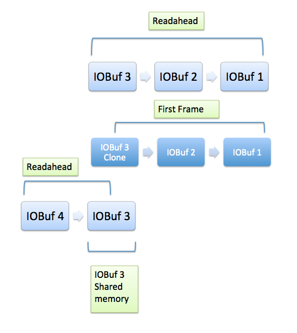
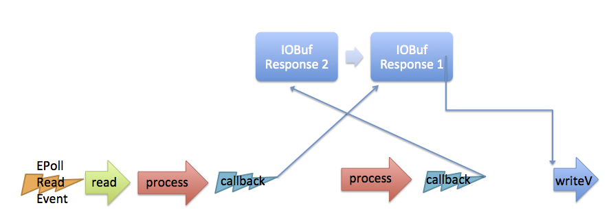
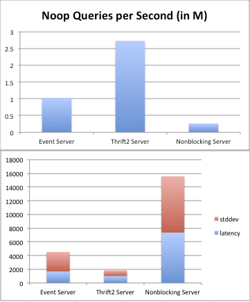
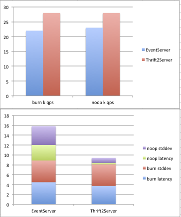

# Cpp2 ThriftServer

This is a re-implementation of both the generated cpp code, and a
fully asynchronous version of the c++ server code. In many ways it is
similar to the older first-generation implementation:

* Can run code inline, or in a ThreadManager queue.

* Has a single acceptor thread, and hands off the accepts to IO
  threads.

* Has many options to handle server overload.

* Uses libevent.

* Maintains wire-format and IDL backwards compatibility.

*And many differences:*

* Updated for C++11.

* Can optionally provide an asynchronous callback, or future
  interface, as well as the previous synchronous server interface.

* Responses can be sent to the client out of order, and processed in
  parallel.

* Supports dynamic compression and tracing via the header.

* Uses eventfd instead of pipes for notification.

* Uses buffer chains
  ([folly/io/IOBuf.h](https://github.com/facebook/folly/blob/master/folly/io/IOBuf.h))
  to prevent large allocations of memory.

* Allows true zero-copy from client to server and back using IOBufs
  (vs. previous generated code that used std::string for binary type).

* It's about 4x as fast as NonblockingServer in our load tests
  (`perf/cpp`) for small requests. Latency is also much improved
  depending on how parallel processing and out of order responses are
  used.

### Prerequisites

This document assumes you are familiar with basic Thrift usage. We
recommend the following to become familiar:
[Apache Thrift](http://thrift.apache.org/),
[Thrift: The Missing Guide](http://diwakergupta.github.io/thrift-missing-guide/),
and [SETT on Apache Thrift](http://jnb.ociweb.com/jnb/jnbJun2009.html).

### Options

Useful (but not complete set of) options that can be set on the ThriftServer:

* `setPort(int)` - set port to listen on.

* `setIdleTimeout(std::chrono::milliseconds)` - milliseconds before we close idle connections.

* `setTaskExpireTime(std::chrono::milliseconds)` - milliseconds before
  we timeout any individual request. This can also be set on a
  per-function bases by overriding the appropriate generated code
  method.

* `setNumIOWorkerThreads(int)` - Number of IO async worker threads. Defaults to number of cores.

* `setNumCPUWorkerThreads(int)` - Number of synchronous pool threads. Defaults
  to number of IO threads. If you do a lot of blocking synchronous
  work, you may want to increase this. This controls the number of normal
  priority threads; the Thrift thread manager can create additional threads for
  other priorities.

* `setInterface(std::shared_ptr<ServerInterface>)` - Your Thrift handler
  interface that subclasses the generated code.

* `setMaxRequests(uint32_t)` - The maximum number of outstanding
  requests.

* `setSSLContext(context)` - Allow SSL connections.

*There are other options for specific use cases, such as*

* `setProcessorFactory(factory)` - Not necessary if setInterface is
  called. Used for custom processors, usually proxies.

### Code example

A service like the following

    service TestService {
      string sendResponse(1:i64 size)
    }

Will generate an interface similar to

    class TestServiceSvIf : public TestServiceSvAsyncIf, public apache::thrift2::ServerInterface {
      ...
      virtual void sendResponse(std::string& _return, int64_t size);
      virtual void async_sendResponse(std::unique_ptr<apache::thrift2::HandlerCallback<std::unique_ptr<std::string>>> callback, int64_t size) = 0;
      virtual folly::Future<std::unique_ptr<std::string>> future_sendResponse(int64_t size);
      ...
    }

So you have three choices of handler type to implement:

1. `sendResponse(...)` is the synchronous method. It will be read and
   deserialized in an IO thread, and then passed to a pool thread to be
   executed. When it returns, `_return` must contain the result, which
   will be passed back to the original IO thread to serialize the
   result and send it on the wire. You can block in this handler as
   long as you wish, although you may need to tune the server more.

2. `async_sendResponse(callback...)` is a callback-style handler. The
   base callback types are defined in [AsyncProcessor.h](https://github.com/facebook/fbthrift/blob/master/thrift/lib/cpp2/async/AsyncProcessor.h).
   Your handler method is called in the context of the receiving IO
   thread: This is meant so that you can make additional IO bound
   calls. If you need to do CPU bound work, it would be better to
   transfer it to the ThreadManager thread pool instead of blocking
   IO. Pseudocode Example:

        virtual void async_sendResponse(std::unique_ptr<apache::thrift2::HandlerCallback<std::unique_ptr<std::string>>> callback, int64_t size) {
          auto client = getClient();
          client->forwardSendRespose([=](Result& result){
            callback->result(result);
          }, size);
        }

  (In production code, care would have to be taken with the lifetime
  of the callback object, and which thread it is called on. See
  [AsyncProcessor.h](https://github.com/facebook/fbthrift/blob/master/thrift/lib/cpp2/async/AsyncProcessor.h) for more info on Callback
  objects).

3. `future_sendResponse(...)` future interface
   [*currently fb only*]. Your handler must return a future object.
   When the future completes, the result will be sent.

You only need to override one of these methods in your handler. They
will be called in turn until an overridden method is found. If you do
not override any method, you will get a runtime error when the method
is called.

### New generated code features

The compiler was rewritten from scratch. We have found that adding
new features was difficult, especially where we needed to manage
changes to .h, .cpp, and .tcc files simultaneously. Instead, the
python framework automatically knows which file changes need to go in.

* Compatibility mode: Typedefs generated structs to be the original
  cpp implementation. This is useful in that you can mix cpp and cpp2
  code freely, assuming they are in different namespaces. This
  precludes using some of the newer features below, however.

* Full Zero Copy binary type: To change the default binary type to
  IOBuf, do something like

        typedef binary (cpp.type = "std::unique_ptr<folly::IOBuf>")
        IOBufPtr

  You can also change the map and other complex types to whatever you
  want this way.

* enum class: Enums are now generated with C++11's enum class
  feature.

* Arguments on heap: By default, complex arguments are on the heap, so
  they can be moved between threads without a copy. To disable this,
  use option `stack_arguments`.

* Support for floats was added.

### Serialization using IOBufs

An IOBuf is a network chained memory buffer, similar to FreeBSD's
mbuf, or the Linux kernel's sk_buff. They can have the memory
internally if small enough, or externally malloced and shared. This is
opaque to the user and done mostly for performance reasons, similar
to fbstring. The IOBuf header itself can point to a subregion of the
allocated memory, like a view.

The main use in Thrift is to allow readahead for incoming data, and
support chaining + writev for outgoing data. Both of these will reduce
the usage of expensive syscalls. A secondary advantage is that we only
need malloc small blocks of data at a time, which is much easier on
the allocator than trying to allocate large megabytes of data.

When the Thrift channel reads the last part of a frame, it clones the
IOBuf. There are now two 'views' on the same shared memory segment:
One part has the first part of the buffer (which is the last part of
the frame), the other is the last part of the buffer, which is the
first part of the readahead data.

Write buffering is similar but in reverse: When sending a response, we
serialize it, then add it to an IOBuf queue. Once per TEventBase loop,
we call writeV with the whole of the queue.

### Performance

* The standard memory allocator for glibc generally has high overhead,
  especially in a threaded environment. There are two factors
  involved: locking and fragmentation. The glibc allocator uses a
  global mutex to allow threads to share a common heap. Since the heap
  is used extensively in Thrift serialization/deserialization and
  elsewhere (e.g. `std::shared_ptr`, `std::bind`) there is a great deal
  of contention for that lock. Alternative allocators such as
  [jemalloc](https://www.facebook.com/jemalloc) maintain per-thread
  heap resources such that locking is much less of an issue. They also
  tend to fragment memory less, though because allocation algorithms
  differ they can use more or less process memory than glibc. Although
  tcmalloc has been used with excellent results, jemalloc has in some
  cases demonstrated even better performance and has the advantage of
  being actively supported and enhanced by Facebook engineer Jason
  Evans.

* Using the load generator, we get some good numbers for QPS. This one
  is Noop's, one thread per core, and sending up to 100 outstanding
  requests to fill up the buffer and show off the readahead / write
  queueing. (Note that performance is similar to previous Thrift
  servers if there is only one outstanding request at a time). In
  practice, it seems raw qps for in-memory type servers (like
  key-value store or similar) is at least 20% better than previous
  servers.

  

  To show off the out of order responses, we send a mix of burn (which
  happens in a task queue), and noop. We would expect noop to have a
  much lower std dev if out of order is working properly.

  

  (times in ms, QPS happen to be in k, but these numbers highly
  dependent on burn time) In practice, out of order does indeed
  reduce latency by almost 50% if your service has interleaved long
  and short requests, but we only saw the improvement at p75 and
  above.

* The previous Thrift ThreadManager used mutexs and condition
  variables to queue tasks and wake up threads. In practice, this
  limited the throughput to around 300k qps. We have overhauled
  ThreadManager to use a lockless MPMC queue, as well as adding LIFO
  worker thread semantics. This improved the throughput to just under
  1M qps. Unfortunately, it is still sensitive to tuning for the
  number of worker and IO threads, due to context switching overhead.
