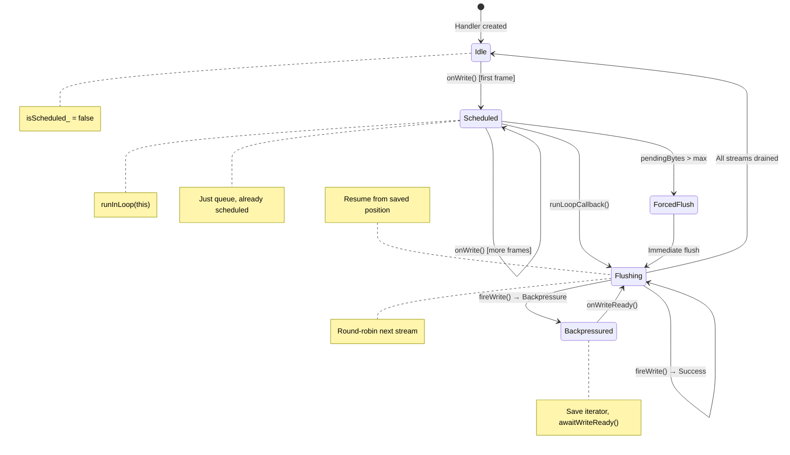

# FrameFragmentationHandler Implementation Plan

## Overview

Implement an outbound pipeline handler that fragments large RSocket frames and interleaves them across streams to mitigate **Head-of-Line (HOL) blocking**. The handler batches frames during an EventBase tick, then flushes using round-robin scheduling across streams at tick end.

### The Problem

In a single-threaded EventBase model, even fragmented payloads are sent sequentially:

```
Current behavior (HOL blocked):
  Stream A: 8MB ready → frag1, frag2, frag3... frag128 (all sequential)
  Stream B: 1KB ready → blocked until all 128 fragments complete
```

### The Solution

Batch frames during the EventBase tick, then round-robin across streams at flush:

```
Desired behavior (HOL mitigated):
  End of tick - flush phase:
    Stream B: 1KB (small, sent immediately)
    Stream A: frag1 (64KB)
    Stream C: frag1 (64KB)
    Stream A: frag2 (64KB)
    Stream C: frag2 (64KB)
    ... round-robin until drained
```

## Design Decisions

| Decision | Choice | Rationale |
|----------|--------|-----------|
| Scheduling Algorithm | Round-Robin | Fixed 64KB fragments provide natural byte-fairness; simpler than WFQ/DRR |
| Map Type | `folly::F14NodeMap<uint32_t, PerStreamState>` | Iterator stability during round-robin while streams complete/start |
| Flush Trigger | `LoopCallback` self-scheduling | Handler schedules itself lazily when work arrives |
| Primary Limit | Max pending bytes | Correlates with memory pressure and latency; fairer than frame count |
| Secondary Limit | Max pending frames | Backstop for many-small-frames pathology |
| Small Frame Handling | Bypass fragmentation | Frames ≤ fragment size sent immediately, no queuing overhead |
| Fragmentation Strategy | Lazy (cursor/offset) | Constant memory regardless of payload size |

## File Structure

```
thrift/lib/cpp2/fast_thrift/framing/writing/
├── PerStreamState.h                         # Per-stream fragment queue state
├── FrameFragmentationHandler.h              # Handler implementation
├── FrameFragmentationHandler.cpp            # Handler implementation (if needed)
├── test/
│   ├── FrameFragmentationHandlerTest.cpp    # Unit tests
│   └── FrameFragmentationHandlerBench.cpp   # Microbenchmarks
└── BUCK                                     # Build targets (update)
```

---

## Phase 1: PerStreamState

**Goal**: Create a struct to hold pending fragment state for a single stream.

### File: `PerStreamState.h`

### Fields

| Field | Type | Purpose |
|-------|------|---------|
| `streamId` | `uint32_t` | Stream identifier |
| `originalPayload` | `std::unique_ptr<folly::IOBuf>` | Original payload being fragmented |
| `currentOffset` | `size_t` | Bytes already sent from payload |
| `totalBytes` | `size_t` | Total size of original payload |
| `frameType` | `FrameType` | Original frame type (REQUEST_*, PAYLOAD) |
| `originalFlags` | `uint16_t` | Original flags from the frame |

### Key Behaviors

1. **Lazy fragmentation**: Don't pre-split into N IOBufs. Track offset and slice on-demand.
2. **hasMore()**: Returns `true` if `currentOffset < totalBytes`
3. **nextFragment(maxSize)**: Returns next chunk up to `maxSize` bytes, advances offset

### Acceptance Criteria

- [ ] Struct compiles and is moveable (not copyable)
- [ ] `hasMore()` correctly reports remaining data
- [ ] `nextFragment()` returns correctly sized chunks
- [ ] Final fragment has FOLLOWS=false, earlier fragments have FOLLOWS=true
- [ ] Zero-copy slicing using IOBuf cursor/clone

---

## Phase 2: FragmentationHandlerConfig

**Goal**: Define configuration parameters for the handler.

### Configuration Parameters

| Parameter | Type | Default | Description |
|-----------|------|---------|-------------|
| `maxFragmentSize` | `size_t` | 64KB | Maximum fragment size; also bypass threshold |
| `maxPendingBytes` | `size_t` | 512KB | High-water mark triggering forced flush |
| `maxPendingFrames` | `size_t` | 128 | Backstop limit for many-small-frames |
| `minSizeToFragment` | `size_t` | 1KB | Minimum payload size worth fragmenting |

### Tuning Guidance

| Scenario | Adjustment |
|----------|------------|
| High-latency network | Larger `maxFragmentSize` (128KB+) |
| Low-latency requirements | Smaller `maxFragmentSize` (32KB) |
| Memory-constrained | Lower `maxPendingBytes` (256KB) |
| High-throughput bulk transfers | Higher `maxPendingBytes` (1MB+) |

### Acceptance Criteria

- [ ] Config struct with sensible defaults
- [ ] All parameters documented
- [ ] Builder pattern or designated initializers for construction

---

## Phase 3: FrameFragmentationHandler Core

**Goal**: Implement the handler satisfying `OutboundHandler` concept with LoopCallback self-scheduling.

### File: `FrameFragmentationHandler.h`

### Class Structure

```
FrameFragmentationHandler : public folly::EventBase::LoopCallback
  - config_: FragmentationHandlerConfig
  - eventBase_: folly::EventBase* (set via handlerAdded)
  - isScheduled_: bool
  - pendingBytes_: size_t
  - pendingFrames_: size_t
  - immediateQueue_: std::deque<Frame>  // Small frames bypass
  - streams_: F14NodeMap<uint32_t, PerStreamState>  // Large frame fragments
  - roundRobinIterator_: iterator (for resume after backpressure)
  - WriteReadyHook writeReadyHook_  // For backpressure
```

### Core Algorithm: onWrite()

```
1. Extract frame from TypeErasedBox
2. Get frame size
3. If size <= maxFragmentSize:
   - Add to immediateQueue_
4. Else:
   - Create PerStreamState with original payload
   - Insert into streams_ map by streamId
5. Increment pendingBytes_ and pendingFrames_
6. If pendingBytes_ > maxPendingBytes OR pendingFrames_ > maxPendingFrames:
   - Call flushNow() (forced mid-tick flush)
7. Else if !isScheduled_:
   - eventBase_->runInLoop(this)
   - isScheduled_ = true
8. Return Result::Success
```

### Core Algorithm: runLoopCallback() (flush)

```
1. Send all frames in immediateQueue_ first:
   - For each frame: ctx.fireWrite(frame)
   - If Result::Backpressure: stop, await write ready
2. Round-robin through streams_ map:
   - For each stream with hasMore():
     - Get next fragment (maxFragmentSize)
     - Set FOLLOWS flag appropriately
     - ctx.fireWrite(fragment)
     - If Result::Backpressure: save iterator position, await write ready
   - If stream has no more data: erase from map
3. Reset pendingBytes_ = 0, pendingFrames_ = 0
4. isScheduled_ = false
```

### Core Algorithm: onWriteReady()

```
1. ctx.cancelAwaitWriteReady()
2. Resume flush from saved position
```

### Handler Lifecycle

- **handlerAdded(ctx)**: Capture EventBase pointer
- **handlerRemoved(ctx)**: Clear all queues, cancel any scheduled callback

### Acceptance Criteria

- [ ] Handler satisfies `OutboundHandler` concept
- [ ] Small frames bypass fragmentation queue
- [ ] Large frames fragment with FOLLOWS flag
- [ ] LoopCallback self-scheduling works correctly
- [ ] Max pending bytes triggers forced flush
- [ ] Backpressure pauses and resumes correctly
- [ ] Per-stream fragment order preserved
- [ ] Round-robin interleaves across streams

---

## Phase 4: Stream Ordering Guarantee

**Goal**: Ensure fragments within a single stream are sent in order.

### Critical Invariant

Fragments within a single stream MUST be sent in order. The design guarantees this:

1. F14NodeMap groups all data for a stream under one key
2. PerStreamState tracks a single offset into the original payload
3. Round-robin pops from each stream sequentially (never out of order)
4. Backpressure resume continues from saved position (not restarting)

### Edge Cases

| Case | Behavior |
|------|----------|
| Stream completes mid-flush | Remove from map, continue to next stream |
| New stream arrives mid-flush | Added to map, will be picked up in current or next round |
| Same stream gets new payload while fragmenting | Queue the new payload (or error - design decision) |

### Design Decision: New Payload While Fragmenting

**Option A**: Queue new payloads per-stream (more complex)
**Option B**: Assert/error - application shouldn't do this (simpler)

**Recommendation**: Option B for v1. Streams should not have overlapping payloads in flight.

### Acceptance Criteria

- [ ] Fragments for same stream always sent in order
- [ ] Interleaving only happens across different streams
- [ ] New stream mid-flush handled gracefully
- [ ] Stream completion mid-flush handled gracefully

---

## Phase 5: Unit Tests

**Goal**: Comprehensive test coverage for all scenarios.

### File: `test/FrameFragmentationHandlerTest.cpp`

### Test Categories

#### 5.1 Basic Cases

| Test | Description |
|------|-------------|
| `SmallFrameBypassesFragmentation` | Frame ≤ 64KB sent immediately via immediateQueue |
| `SmallFrameNoScheduling` | Single small frame doesn't wait for LoopCallback if under threshold |
| `LargeFrameFragmented` | Frame > 64KB split into multiple fragments with FOLLOWS flag |
| `FragmentSizesCorrect` | Each fragment ≤ maxFragmentSize, final fragment has remainder |
| `FollowsFlagCorrect` | All fragments except last have FOLLOWS=true |
| `OriginalFrameTypePreserved` | Fragments maintain original frame type |

#### 5.2 Round-Robin Interleaving

| Test | Description |
|------|-------------|
| `TwoStreamsInterleave` | Stream A and B fragments alternate: A1, B1, A2, B2, ... |
| `ThreeStreamsInterleave` | Three streams round-robin correctly |
| `UnevenStreamsInterleave` | Stream with more fragments continues after others complete |
| `StreamCompletionMidRound` | Stream finishing doesn't break round-robin |

#### 5.3 Flush Triggering

| Test | Description |
|------|-------------|
| `FlushOnLoopCallback` | Queued frames flush at end of EventBase tick |
| `FlushOnMaxPendingBytes` | Exceeding byte threshold forces immediate flush |
| `FlushOnMaxPendingFrames` | Exceeding frame count forces immediate flush |
| `SelfSchedulingOnlyOnce` | Multiple writes schedule only one callback |
| `NoSchedulingWhenEmpty` | No callback scheduled if no pending work |

#### 5.4 Backpressure

| Test | Description |
|------|-------------|
| `BackpressurePausesFlush` | Result::Backpressure stops flush mid-round-robin |
| `BackpressureDuringImmediateQueue` | Backpressure during small frame flush |
| `WriteReadyResumesFlush` | onWriteReady() continues from saved position |
| `BackpressurePreservesOrder` | Resumed flush maintains correct order |
| `MultipleBackpressureCycles` | Multiple pause/resume cycles work correctly |

#### 5.5 Edge Cases

| Test | Description |
|------|-------------|
| `EmptyFlush` | LoopCallback with no pending work is no-op |
| `ZeroBytePayload` | Empty payload handled (passthrough or skip) |
| `ExactlyMaxFragmentSize` | Payload exactly 64KB: one fragment, no FOLLOWS |
| `JustOverMaxFragmentSize` | Payload 64KB+1: two fragments |
| `HandlerRemovedClearsState` | handlerRemoved() clears all queues and state |
| `NewStreamDuringFlush` | New stream added during flush iteration |

### Test Utilities

```cpp
// Mock EventBase for testing LoopCallback
class MockEventBase { ... };

// Mock context tracking fireWrite calls
class MockContext {
  std::vector<Frame> writtenFrames;
  bool returnBackpressure{false};
  size_t backpressureAfterN{SIZE_MAX};
};

// Helper to create frames of specific sizes
Frame makeFrame(uint32_t streamId, size_t payloadSize, FrameType type);
```

### Acceptance Criteria

- [ ] All basic case tests pass
- [ ] All round-robin tests pass
- [ ] All flush triggering tests pass
- [ ] All backpressure tests pass
- [ ] All edge case tests pass
- [ ] Test utilities are reusable

---

## Phase 6: Microbenchmarks

**Goal**: Measure overhead to ensure acceptable performance.

### File: `test/FrameFragmentationHandlerBench.cpp`

### Benchmark Scenarios

| Benchmark | Description | Key Metric |
|-----------|-------------|------------|
| `BM_SmallFramePassthrough` | Small frames through handler | Overhead vs direct |
| `BM_LargeFrameFragmentation` | Single large frame fragmented | Per-fragment cost |
| `BM_RoundRobin_10Streams` | 10 streams interleaved | Scheduling overhead |
| `BM_RoundRobin_100Streams` | 100 streams interleaved | Map scaling |
| `BM_BackpressureResume` | Pause/resume cycle cost | Resume overhead |
| `BM_FlushVariousPayloads` | Mixed small/large payloads | Real-world mix |

### Expected Metrics

| Scenario | Target | Notes |
|----------|--------|-------|
| Small frame passthrough | < 100ns overhead | Should be nearly free |
| Per-fragment cost | < 500ns | Slicing + header update |
| 100 streams round-robin | < 10% overhead vs 10 | F14NodeMap scales well |

### Acceptance Criteria

- [ ] All benchmarks compile and run
- [ ] Small frame overhead minimal (< 100ns)
- [ ] Fragmentation overhead acceptable
- [ ] Scaling behavior documented
- [ ] No memory leaks under sustained load

---

## Phase 7: BUCK Integration

**Goal**: Add build targets for new files.

### Updates to `writing/BUCK`

```python
cpp_library(
    name = "per_stream_state",
    headers = ["PerStreamState.h"],
    deps = [
        "//folly/io:iobuf",
        ":frame_type",
        ":frame_headers",
    ],
)

cpp_library(
    name = "frame_fragmentation_handler",
    headers = ["FrameFragmentationHandler.h"],
    srcs = ["FrameFragmentationHandler.cpp"],  # if needed
    deps = [
        "//folly/container:f14_hash",
        "//folly/io:async_base",
        "//folly/io:iobuf",
        ":per_stream_state",
        ":frame_writer",
        "//thrift/lib/cpp2/fast_thrift/channel_pipeline:common",
        "//thrift/lib/cpp2/fast_thrift/channel_pipeline:backpressure",
        "//thrift/lib/cpp2/fast_thrift/channel_pipeline:type_erased_box",
    ],
)
```

### Updates to `writing/test/BUCK`

```python
cpp_unittest(
    name = "frame_fragmentation_handler_test",
    srcs = ["FrameFragmentationHandlerTest.cpp"],
    deps = [
        "//thrift/lib/cpp2/fast_thrift/framing/writing:frame_fragmentation_handler",
        "//folly/portability:gtest",
    ],
)

cpp_binary(
    name = "frame_fragmentation_handler_bench",
    srcs = ["FrameFragmentationHandlerBench.cpp"],
    deps = [
        "//thrift/lib/cpp2/fast_thrift/framing/writing:frame_fragmentation_handler",
        "//folly:benchmark",
    ],
)
```

### Acceptance Criteria

- [ ] All targets build successfully
- [ ] Tests run via buck2 test
- [ ] Benchmarks run via buck2 run
- [ ] Dependencies correctly specified

---

## Implementation Order

1. **Phase 1**: `PerStreamState.h` - Core fragment tracking struct
2. **Phase 2**: `FragmentationHandlerConfig` - Configuration
3. **Phase 3**: `FrameFragmentationHandler` - Main handler implementation
4. **Phase 4**: Stream ordering verification - Ensure correctness
5. **Phase 5**: Unit tests - Verify all scenarios
6. **Phase 6**: Benchmarks - Verify performance
7. **Phase 7**: BUCK integration - Build system

## Dependencies

- Depends on existing `FrameWriter` for serializing fragment headers
- Depends on `channel_pipeline` Handler concept and backpressure mechanism
- Uses `folly::EventBase::LoopCallback` for tick-end scheduling
- Uses `folly::F14NodeMap` for stream state tracking

---

## Integration Notes

### Handler Position in Pipeline

```
Application
    ↓ write(payload)
FrameFragmentationHandler  ← NEW: batches, fragments, round-robins
    ↓ write(fragment)
FrameWriter                ← Serializes to wire format
    ↓ write(IOBuf)
Transport Adapter          ← TCP socket
```

### Client vs Server

Both sides use the same handler. Server typically benefits more due to larger response sizes.

### Interaction with REQUEST_N

Fragmentation and flow control are orthogonal:
- **Fragmentation**: Interleaving of bytes on the wire (HOL mitigation)
- **REQUEST_N**: Number of logical payloads sender can emit (rate limiting)

A single REQUEST_N credit may result in multiple fragments.

---

## Success Criteria

- [ ] Small frames bypass fragmentation with minimal overhead
- [ ] Large frames fragment correctly with FOLLOWS flag
- [ ] Round-robin provides fair interleaving across streams
- [ ] LoopCallback self-scheduling works correctly
- [ ] Max pending bytes triggers forced flush
- [ ] Backpressure pauses and resumes flush correctly
- [ ] Per-stream fragment order preserved
- [ ] All unit tests pass
- [ ] Benchmarks show acceptable overhead
- [ ] Handler integrates into existing pipeline
- [ ] Code follows Meta C++ conventions

---

## Interaction Diagram: LoopCallback → Round-Robin → Backpressure Resume

```mermaid
sequenceDiagram
    participant App as Application
    participant Handler as FrameFragmentationHandler
    participant EB as EventBase
    participant Downstream as Downstream Handler
    participant Transport as Transport

    Note over App,Transport: === WRITE PHASE (during EventBase tick) ===

    App->>Handler: onWrite(Stream A: 200KB)
    Handler->>Handler: size > 64KB → add to streams_[A]
    Handler->>Handler: pendingBytes_ += 200KB
    Handler->>EB: runInLoop(this) [if !isScheduled_]
    Handler->>Handler: isScheduled_ = true
    Handler-->>App: Result::Success

    App->>Handler: onWrite(Stream B: 1KB)
    Handler->>Handler: size ≤ 64KB → add to immediateQueue_
    Handler->>Handler: pendingBytes_ += 1KB
    Handler->>Handler: already scheduled, skip
    Handler-->>App: Result::Success

    App->>Handler: onWrite(Stream C: 150KB)
    Handler->>Handler: size > 64KB → add to streams_[C]
    Handler->>Handler: pendingBytes_ += 150KB
    Handler-->>App: Result::Success

    Note over App,Transport: === FLUSH PHASE (end of EventBase tick) ===

    EB->>Handler: runLoopCallback()

    Note over Handler: Step 1: Drain immediateQueue_
    Handler->>Downstream: fireWrite(Stream B: 1KB)
    Downstream-->>Handler: Result::Success

    Note over Handler: Step 2: Round-Robin large frames

    rect rgb(200, 230, 200)
        Note over Handler: Round 1
        Handler->>Handler: streams_[A].nextFragment(64KB)
        Handler->>Downstream: fireWrite(A:frag1, FOLLOWS=true)
        Downstream->>Transport: write
        Transport-->>Downstream: Success
        Downstream-->>Handler: Result::Success

        Handler->>Handler: streams_[C].nextFragment(64KB)
        Handler->>Downstream: fireWrite(C:frag1, FOLLOWS=true)
        Downstream->>Transport: write
        Transport-->>Downstream: Success
        Downstream-->>Handler: Result::Success
    end

    rect rgb(200, 230, 200)
        Note over Handler: Round 2
        Handler->>Handler: streams_[A].nextFragment(64KB)
        Handler->>Downstream: fireWrite(A:frag2, FOLLOWS=true)
        Downstream->>Transport: write
        Transport-->>Downstream: Success
        Downstream-->>Handler: Result::Success

        Handler->>Handler: streams_[C].nextFragment(64KB)
        Handler->>Downstream: fireWrite(C:frag2, FOLLOWS=true)
        Downstream->>Transport: write
        Transport-->>Downstream: Success
        Downstream-->>Handler: Result::Success
    end

    rect rgb(255, 220, 220)
        Note over Handler: Round 3 - BACKPRESSURE!
        Handler->>Handler: streams_[A].nextFragment(64KB)
        Handler->>Downstream: fireWrite(A:frag3, FOLLOWS=true)
        Downstream->>Transport: write
        Transport-->>Downstream: EAGAIN (buffer full)
        Downstream-->>Handler: Result::Backpressure

        Handler->>Handler: Save iterator at Stream A
        Handler->>Handler: awaitWriteReady()
        Note over Handler: PAUSE - exit runLoopCallback
    end

    Note over App,Transport: === BACKPRESSURE WAIT ===

    Note over Transport: TCP send buffer drains...
    Transport->>Downstream: Socket writable
    Downstream->>Handler: onWriteReady()

    Note over App,Transport: === RESUME PHASE ===

    rect rgb(200, 230, 255)
        Note over Handler: Resume from saved position (Stream A, frag3)
        Handler->>Handler: cancelAwaitWriteReady()

        Handler->>Downstream: fireWrite(A:frag3, FOLLOWS=true) [retry]
        Downstream->>Transport: write
        Transport-->>Downstream: Success
        Downstream-->>Handler: Result::Success

        Handler->>Handler: streams_[C].nextFragment(64KB)
        Handler->>Downstream: fireWrite(C:frag3, FOLLOWS=false) [last]
        Downstream-->>Handler: Result::Success
        Handler->>Handler: erase streams_[C]
    end

    rect rgb(200, 230, 255)
        Note over Handler: Continue Round 4
        Handler->>Handler: streams_[A].nextFragment(64KB)
        Handler->>Downstream: fireWrite(A:frag4, FOLLOWS=false) [last]
        Downstream-->>Handler: Result::Success
        Handler->>Handler: erase streams_[A]
    end

    Note over Handler: All streams drained
    Handler->>Handler: pendingBytes_ = 0
    Handler->>Handler: pendingFrames_ = 0
    Handler->>Handler: isScheduled_ = false
```



### State Machine View



### Data Flow Summary

```
┌─────────────────────────────────────────────────────────────────────────────┐
│                        FrameFragmentationHandler                            │
├─────────────────────────────────────────────────────────────────────────────┤
│                                                                             │
│  onWrite(frame)                                                             │
│       │                                                                     │
│       ▼                                                                     │
│  ┌─────────────┐     ≤64KB      ┌──────────────────┐                       │
│  │ Size check  │───────────────▶│ immediateQueue_  │                       │
│  └─────────────┘                └──────────────────┘                       │
│       │                                  │                                  │
│       │ >64KB                            │                                  │
│       ▼                                  │                                  │
│  ┌─────────────────────────────────┐     │                                  │
│  │ F14NodeMap<StreamId, State>     │     │                                  │
│  │ ┌─────┬─────────────────────┐   │     │                                  │
│  │ │ S:A │ offset=0, total=200K│   │     │                                  │
│  │ ├─────┼─────────────────────┤   │     │                                  │
│  │ │ S:C │ offset=0, total=150K│   │     │                                  │
│  │ └─────┴─────────────────────┘   │     │                                  │
│  └─────────────────────────────────┘     │                                  │
│       │                                  │                                  │
│       └──────────────┬───────────────────┘                                  │
│                      │                                                      │
│                      ▼                                                      │
│              ┌───────────────┐                                              │
│              │ LoopCallback  │ (end of EventBase tick)                      │
│              └───────────────┘                                              │
│                      │                                                      │
│                      ▼                                                      │
│  ┌───────────────────────────────────────────────────────────────────────┐  │
│  │                         FLUSH ALGORITHM                               │  │
│  │                                                                       │  │
│  │  1. Drain immediateQueue_ first (small frames, low latency)          │  │
│  │                                                                       │  │
│  │  2. Round-robin through F14NodeMap:                                  │  │
│  │     ┌─────────────────────────────────────────────────┐              │  │
│  │     │  for each stream in map:                        │              │  │
│  │     │    frag = stream.nextFragment(64KB)             │              │  │
│  │     │    result = fireWrite(frag)                     │              │  │
│  │     │    if Backpressure:                             │              │  │
│  │     │      save position, awaitWriteReady(), return   │◄─── PAUSE    │  │
│  │     │    if stream.done(): erase from map             │              │  │
│  │     │  repeat until all streams empty                 │              │  │
│  │     └─────────────────────────────────────────────────┘              │  │
│  │                                                                       │  │
│  │  3. Reset: pendingBytes_=0, isScheduled_=false                       │  │
│  └───────────────────────────────────────────────────────────────────────┘  │
│                      │                                                      │
│                      ▼                                                      │
│              ┌───────────────┐                                              │
│              │ onWriteReady  │ (downstream ready)                           │
│              └───────────────┘                                              │
│                      │                                                      │
│                      ▼                                                      │
│              Resume from saved iterator position ──────────────► RESUME     │
│                                                                             │
└─────────────────────────────────────────────────────────────────────────────┘
```

---

## Documentation Requirement

### Developer Documentation

**IMPORTANT**: This handler has non-trivial scheduling behavior that future developers need to understand. Include comprehensive documentation via one of these approaches:

#### Option A: Reference to External MD File (Recommended)

Create `FrameFragmentationHandler.md` alongside the header with full design docs:

```
thrift/lib/cpp2/fast_thrift/framing/writing/
├── FrameFragmentationHandler.h
├── FrameFragmentationHandler.md   ← Design doc with diagrams
└── ...
```

At the top of `FrameFragmentationHandler.h`, include:

```cpp
/**
 * FrameFragmentationHandler - Outbound handler for HOL blocking mitigation.
 *
 * This handler fragments large RSocket frames and interleaves them across
 * streams using round-robin scheduling at EventBase tick boundaries.
 *
 * For detailed design documentation including:
 *   - Round-robin scheduling algorithm
 *   - LoopCallback self-scheduling mechanism
 *   - Backpressure pause/resume flow
 *   - Interaction diagrams
 *
 * See: FrameFragmentationHandler.md
 */
```

#### Option B: Inline Header Comment

If a separate file is not desired, include a detailed block comment at the top of the header:

```cpp
/**
 * FrameFragmentationHandler - Outbound handler for HOL blocking mitigation.
 *
 * == PROBLEM ==
 * In a single-threaded EventBase, large payloads block small payloads even
 * when fragmented, because all fragments are sent sequentially.
 *
 * == SOLUTION ==
 * Batch frames during EventBase tick, round-robin at tick end:
 *   1. Small frames (≤64KB) → immediateQueue_, sent first
 *   2. Large frames (>64KB) → F14NodeMap by streamId, round-robin fragments
 *
 * == KEY MECHANISMS ==
 *
 * LoopCallback Self-Scheduling:
 *   - First onWrite() schedules via eventBase_->runInLoop(this)
 *   - runLoopCallback() flushes all queued data
 *   - isScheduled_ prevents redundant scheduling
 *
 * Round-Robin Flush:
 *   - Iterate F14NodeMap entries
 *   - Pop one 64KB fragment per stream per round
 *   - Preserves per-stream order while interleaving across streams
 *
 * Backpressure:
 *   - On Result::Backpressure: save iterator, awaitWriteReady()
 *   - On onWriteReady(): resume from saved position
 *
 * Forced Flush:
 *   - If pendingBytes_ > maxPendingBytes: flush immediately
 *   - Prevents unbounded memory growth in tight loops
 *
 * == CONFIGURATION ==
 *   maxFragmentSize:  64KB (fragment size, also bypass threshold)
 *   maxPendingBytes: 512KB (forced flush threshold)
 *   maxPendingFrames: 128  (backstop limit)
 */
```

### Acceptance Criteria

- [ ] Design documentation is accessible to future developers
- [ ] Key mechanisms (scheduling, round-robin, backpressure) are explained
- [ ] Either external MD reference or inline comment is present
- [ ] Diagrams are available (in .md file or linked)

---

## CRITICAL: Composable Handler Design

### This is a Free-Standing, Injectable Handler

**The entire point of channel_pipeline is composition.** This handler:

1. **Is self-contained** - No special integration required
2. **Can be injected anywhere** in the outbound pipeline
3. **Works with existing handlers** - Just add it to the pipeline builder
4. **Can be removed** without breaking anything else

### Usage

```cpp
// Simply add to pipeline - no special wiring needed
auto pipeline = PipelineBuilder()
    .addHandler<SomeUpstreamHandler>()
    .addHandler<FrameFragmentationHandler>(config)  // ← Just inject it
    .addHandler<FrameWriter>()
    .addHandler<TransportAdapter>(socket)
    .build();
```

### What This Handler Does NOT Do

| NOT Responsible For | Handled By |
|---------------------|------------|
| Frame serialization | `FrameWriter` (downstream) |
| TCP write | `TransportAdapter` (downstream) |
| Frame parsing | `FrameParser` (different pipeline direction) |
| Reassembly | `FrameDefragmentationHandler` (inbound pipeline) |
| Connection management | `ConnectionHandler` |
| Stream state | Application layer |

### What This Handler ONLY Does

1. **Receives** frames from upstream handlers
2. **Batches** them during EventBase tick
3. **Fragments** large frames (>64KB)
4. **Interleaves** via round-robin
5. **Forwards** to downstream handlers

### Composability Guarantees

| Guarantee | How |
|-----------|-----|
| **No upstream coupling** | Accepts any `TypeErasedBox` with frame data |
| **No downstream coupling** | Calls `ctx.fireWrite()` like any other handler |
| **No EventBase ownership** | Uses `eventBase_` from context, doesn't manage it |
| **Standard backpressure** | Uses existing `WriteReadyHook` mechanism |
| **Standard lifecycle** | Implements `handlerAdded`/`handlerRemoved` |

### Pipeline Position

```
Can be inserted at any point in outbound chain:

Application
    ↓
[Any upstream handlers]
    ↓
FrameFragmentationHandler  ← Injectable here
    ↓
[Any downstream handlers]
    ↓
Transport
```

### No Fragmentation Needed? Don't Add It.

```cpp
// Pipeline WITHOUT fragmentation handler - works fine
auto simplePipeline = PipelineBuilder()
    .addHandler<FrameWriter>()
    .addHandler<TransportAdapter>(socket)
    .build();

// Pipeline WITH fragmentation handler - just add it
auto fragmentingPipeline = PipelineBuilder()
    .addHandler<FrameFragmentationHandler>(config)
    .addHandler<FrameWriter>()
    .addHandler<TransportAdapter>(socket)
    .build();
```

The handler is **opt-in** and **compositional** - the core channel_pipeline architecture principle.

---

## Testing: Standalone, Self-Contained

### Tests Are Standalone

Just like the handler itself, the tests are **completely standalone**:

- **No integration with existing test suites** required
- **No modification of other test files** needed
- **Own test fixtures** - create what's needed locally
- **Own mock context** - simple mock satisfying handler concept

### Test File Structure

```
thrift/lib/cpp2/fast_thrift/framing/writing/test/
├── FrameFragmentationHandlerTest.cpp    ← Standalone unit tests
└── FrameFragmentationHandlerBench.cpp   ← Standalone benchmarks
```

### Simple Mock Context (Local to Test File)

```cpp
// Defined locally in FrameFragmentationHandlerTest.cpp
// NOT shared, NOT in a common header - just what this test needs
class MockContext {
  std::vector<Frame> written_;
  bool backpressure_{false};

  Result fireWrite(TypeErasedBox&& msg) {
    if (backpressure_) return Result::Backpressure;
    written_.push_back(extractFrame(msg));
    return Result::Success;
  }
  // ... minimal interface needed
};
```

### No Coupling to Other Tests

| DO | DON'T |
|----|-------|
| Create standalone test file | Modify existing test files |
| Define local test fixtures | Import shared test utilities |
| Use simple mocks | Depend on complex test infrastructure |
| Test in isolation | Require integration test setup |

### Rationale

The handler is composable and standalone → the tests should be too. This:
1. Makes tests easier to understand
2. Avoids coupling to unrelated code
3. Allows the handler to be moved/copied independently
4. Matches the design philosophy of channel_pipeline
